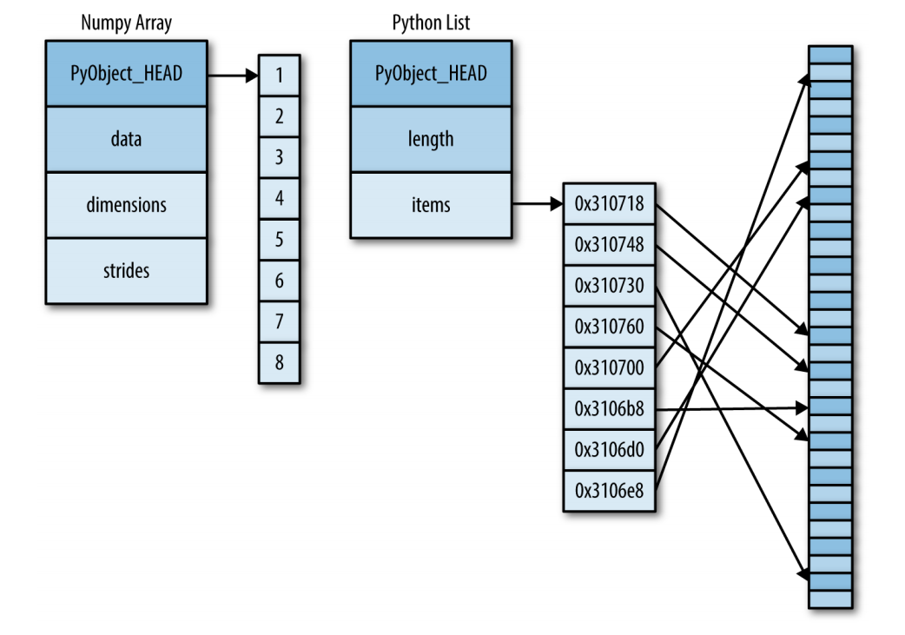
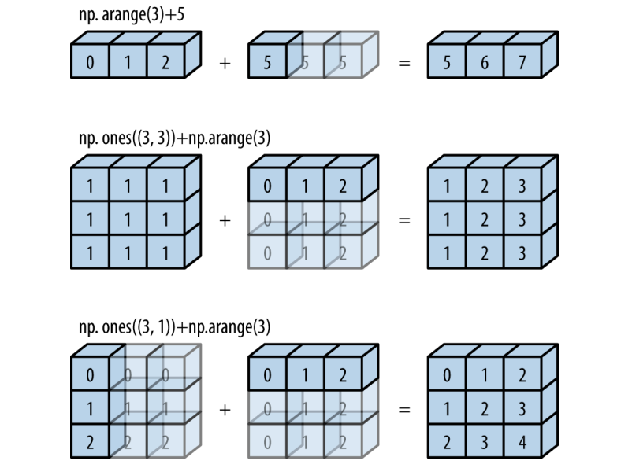

# Билеты по питону второй семестр

## 1. Менеджер пакетов pip. Мотивация использования. Основные команды: install, list, show, freeze, uninstall. Работа с зависимостями Python-проекта

Менеджер пакетов pip утилита( _pip install packages_ ), урощающая жизнь программистов, помогая устанавливать им различные библиотеки.Начиная с версии 3.4 идет вместе с интерперетатором, если же его нет устанавливается вручную.

### Основные команды

Для начала мы хотим понять есть у нас pip или нет, поэтому нужно проверить его наличие командой:

*Windows (cmd, не PowerShell)*:
```console
where pip
```

*Linux/MacOS*:
```console
which pip
```
Данная команда возвращает абсолютный путь до местонахождения pip, если несколько версий вернет все, если ничего не вывело, значит нужно или установить pip или добавить его в PATH.


Затем в это окружение нужно установить библиотеки это делается через:

```console
pip install <package> [<package2> <package3> ...]
python -m pip install <package> [<package2> <package3> ...]
```
Команда выполнила поиск библиотеки и зависимостей и установила ее из удаленного хранилища.

Если хотим установить через кастомный индекс пишем:

```console
pip install -i https://index-url.com <package-name>
```
Чтобы установить библиотеку с github воспользуемся:

```console
pip install git+https://github.com/repo/package
```
Если хотим установить библиотеку из текущей папки(например свою) можно использовать:

```console
pip install -e .
```
В этой папке должен быть setup.py

Иногда нам требуется получить текущие зависимости библиотеки, проекта, тогда используем:

```console
pip list
```
Выведет таблицу библиотек и их версий

Для подробной информации о библиотеки воспользуемся 

```console
pip show
```
Выдаст название, версию, краткое писание, домашнюю страницу, зависимости от других и для других библиотек, расположение

Очень чатсо нужно установить нужные библиотеки на компе или указать другим разработчикам, что использовать и для упрощения этого процесса создается файл _requirements.txt_ 
В нем лежит список зависимостей

*requirements.txt*:
```txt
matplotlib==3.8.2
pandas==2.1.4
numpy==1.26.3
```
Версии можно не писать, но это не очень хорошая практика, также можно указывать знаки сравнения или диапазоны версий

```txt
matplotlib>=3.8.2
pandas>=2.1.4, <2.5.1
numpy==1.26.3
```
Также очень часто нужны библиотеки для разработки(_pytest_)

*requirements_dev.txt*:
```txt
-r requirements.txt
pytest
```

Чтобы установить нужное пишем:

```console
pip instal -r requirements.txt
```
Чтобы не вводить библиотеки вручную воспользуемся 

```console
pip freeze > requirements.txt
```
Для удаления библиотеки достаточно выполнить команду:
```console
pip uninstall <package>
```
Для безопасного удаления библиотеки можем через команды выше узнать зависимости и подумать,иногда pip сам предупреждает о небезопасности и не дает удалить.

## 2. Виртуальное окружение. Мотивация использования. Основы работы с виртуальным окружением с помощью venv. 

Для начала работы, если хотим отдельные зависимости для проекта или протестировать библиотеку мы должны создать виртуальное окружение.
Виртуальное окружение, в котором мы можем вести работы независимо, не трогая остальные файлы.
#### Мотивация использования

1) Загрязнение системы. Без venv все библиотеки будут установлены в _site-packages_ из-за чего могут возникать проблемы затирания библиотек и их перемешивание

2) Конфликт зависимостей. Обычно разные проекты требуют разных библиотек и поэтому мы хотим разделить их, чтобы избежать потенциального их конфликта или кофликта версий.В дополнение: если мы используем pip freeze в одном проекте для других его участников, то мы получим вообще все зависимости, а нужно только определенное и эту проблему также решает venv.

#### Команды
Создание и активация
```console
python -m venv <venv-name>
``` 

*Windows*:
```console
.\venv\Scripts\activate
```

*Linux/MacOS*:
```console
source venv/bin/activate
```

- В начало содержимого переменной PATH дописывается путь к интерпретатору, который хранится в папке `venv-name`;
- В начале командной строке высвечивается сообщение `(venv-name)`, которое сигнализирует пользователю об активном виртуальном окружении.

Удаление

```console
deactivate
```

Эта команда отменит все изменения, которые были внесены в систему при активации виртуального окружения.

## 3. NumPy. Мотивация использования. Пример задачи, для решения которой целесообразно использовать NumPy.

NumPy — библиотека Python для работы с многомерными массивами и математическими операциями. Она широко используется в анализе данных, научных вычислениях и машинном обучении, являясь основой для библиотек, таких как Pandas и scikit-learn.

NumPy эффективно обрабатывает:
- **Одномерные массивы**: временные ряды (например, амплитуды сигналов).
- **Многомерные массивы (тензоры)**: цветные и черно-белые изображения, нейронные сети.

## Мотивация использования

"Чистый" Python не подходит для больших массивов:
1. **Медленные операции**: списки обрабатываются поэлементно через интерпретатор.
2. **Неэффективная память**: списки хранят указатели на объекты, а не сами данные.
3. **Отсутствие векторизации**: нет встроенной поддержки параллельных вычислений.

NumPy решает эти проблемы:
- Хранит данные в непрерывных блоках памяти.
- Использует C для быстрых вычислений.
- Поддерживает векторизацию, упрощая код и ускоряя выполнение.

## Пример задачи: Умножение матриц

Рассмотрим задачу перемножения двух матриц размером 500×1000 и 1000×500.

### На чистом Python
Используем вложенные списки и циклы:

```python
def multiply_matrices_python(lhs, rhs):
    rows_lhs = len(lhs)
    cols_lhs = len(lhs[0])
    cols_rhs = len(rhs[0])
    result = [[0 for _ in range(cols_rhs)] for _ in range(rows_lhs)]
    for i in range(rows_lhs):
        for j in range(cols_rhs):
            for k in range(cols_lhs):
                result[i][j] += lhs[i][k] * rhs[k][j]
    return result

# Пример
lhs = [[1, 2], [3, 4]]
rhs = [[5, 6], [7, 8]]
result = multiply_matrices_python(lhs, rhs)
print(result)  # [[19, 22], [43, 50]]
```

Для больших матриц (500×1000) выполнение занимает ~10–20 секунд из-за трех вложенных циклов и интерпретируемого кода.

### На NumPy
Используем массивы и оператор `@`:

```python
import numpy as np

lhs = np.random.randint(-10, 10, size=(500, 1000))
rhs = np.random.randint(-10, 10, size=(1000, 500))
result = lhs @ rhs
```

NumPy выполняет ту же операцию за ~0.01–0.1 секунды, благодаря:
- Векторизации (операции над всеми элементами сразу).
- Оптимизированным библиотекам (например, BLAS).
- Эффективному управлению памятью.

## 4. Массивы NumPy. Отличие массивов NumPy от списков Python: строгая типизация элементов, хранение элементов в памяти. 


Любой объект в CPython - это не просто ячейка памяти со значением, как это было в C или C++. Объект в CPython - это указатель на структуру C. В этой структуре, помимо самого значения объекта хранятся метаданные объекта, которые используются интерпретатором Python. К числу таких данных относится тип объекта, счетчик ссылок, размер объекта. Массивы же - это не просто указатели на непрерывные блоки памяти с необходимыми данными, которые можно было бы быстро обрабатывать за счет кеширования. Массивы в CPython - это непрерывные области памяти, в которых хранятся адреса объектов CPython в памяти. Таким образом при обработке массива, мы читаем данные из памяти два раза: сначала адрес объекта, а потом сам объект.При этом указатели указывают непосредственно на кучу,поэтому данные не всегда лежат последовательно, а значит не совсем эффективно так хранить.

NumPy подходит иначе к хранению данных. `NumPy` (сокращение от *Numerical Python*) - библиотека для эффективной работы с плотными массивами однородных данных. Особенно стоит выделить слово "однородными", ведь именно оно позволяет понять причину эффективности NumPy. Массивы NumPy являются оберткой вокруг C-массивов, т.е. массив NumPy инкапсулирует указатель на непрерывный блок в памяти, в котором хранятся данные одного типа. Это сильно ускоряет работу с этими данными и даже позволяет сэкономить память.
 
Элементы numpy array строго типизированы и однородны:



### Основные типы

1) int8
2) int16
3) int32
4) int64
5) uint8
6) uint16
7) uint32
8) uint64
9) object
10) array

## 5. Основные способы создания массивов NumPy: функции для создания массивов NumPy из объектов Python, функции для создания массивов NumPy с нуля. 

# Билет 5: Основные способы создания массивов NumPy

## 1. Функции для создания массивов NumPy из объектов Python

Основной способ создания массивов из существующих данных — функция `np.array()`. Она принимает массиво-подобные объекты (например, списки или кортежи) и преобразует их в массивы NumPy.

### Пример 1: Создание одномерного массива
```python
import numpy as np

python_list = [0, 1, 2, 3, 4]
array_ints = np.array(python_list)
```

### Пример 2: Создание массива с приведением типов
Если в списке есть данные разных типов, NumPy приводит их к общему типу:
```python
python_list = [0, 1, 2, 3.14, 4]
array_floats = np.array(python_list)
```

### Пример 3: Указание типа данных
Тип данных можно задать явно с помощью параметра `dtype`:
```python
array_doubles = np.array([0, 1, 2, 3, 4], dtype=np.float64)
```

### Пример 4: Создание массива объектов
Для разнородных данных можно использовать тип `object`:
```python
array_of_objects = np.array([1, 2.27, [1, 2, 3], {"a": 1}], dtype=object)
```

### Пример 5: Создание двумерного массива
Многомерные массивы создаются из вложенных списков, но их размеры должны быть согласованы:
```python
array_2d = np.array([[0, 1, 2], [3, 4, 5]])
```

**Примечание**: Если вложенные списки имеют разную длину, NumPy не создаст прямоугольный массив, а вернет массив типа `object`.

---

## 2. Функции для создания массивов NumPy "с нуля"

NumPy предоставляет функции для создания массивов без использования существующих данных. Эти методы полезны для инициализации массивов с заданными значениями или структурами.

### 2.1. Массивы с одинаковыми значениями

#### `np.zeros(shape, dtype)`
Создает массив, заполненный нулями:
```python
zeros_1d = np.zeros(5, dtype=np.int32)
zeros_2d = np.zeros((2, 3), dtype=np.float32)
```
#### `np.zeros_like(array,list)`
Создает массив, заполненный нулями как и поданный:
```python
lis=[1,2,3,4]
zeros=np.zeros_like(lis)
```

#### `np.ones(shape, dtype)`
Создает массив, заполненный единицами:
```python
ones_1d = np.ones(3, dtype=np.float64)
```

#### `np.full(shape, fill_value, dtype)`
Создает массив, заполненный заданным значением:
```python
full_2d = np.full((2, 2), 255, dtype=np.uint8)
```

### 2.2. Массивы с последовательностями

#### `np.linspace(start, stop, num, dtype)`
Генерирует массив с равномерно распределенными значениями:
```python
linspace_array = np.linspace(0, np.pi, 5)
print(linspace_array)
```

### 2.3. Случайные массивы (подмодуль `random`)

#### `np.random.normal(loc, scale, size)`
Создает массив с нормально распределенными значениями:
```python
normal_array = np.random.normal(0, 1, (2, 2))
#centre sclae(стандартное отклонение) size
# [[-0.123  0.456]
#  [ 1.789 -0.234]]
```

#### `np.random.uniform(low, high, size)`
Создает массив с равномерно распределенными значениями:
```python
uniform_array = np.random.uniform(-10, 10, (2, 2))
# [[-2.34  5.67]
#  [ 8.90 -1.23]]
```

#### `np.random.randint(low, high, size)`
Создает массив случайных целых чисел:
```python
randint_array = np.random.randint(0, 10, (2, 2))
```

### 2.4. Специальные матрицы

#### `np.eye(N, M, dtype)`
Создает единичную матрицу:
```python
eye_matrix = np.eye(3, dtype=np.float32)
```

#### `np.diag(v, k)`
Создает диагональную матрицу:
```python
diag_matrix = np.diag([1, 2, 3])
```

### 2.5. Пустой массив

#### `np.empty(shape, dtype)`
Создает неинициализированный массив (содержит "мусор" из памяти):
```python
empty_array = np.empty((2, 2))
```

**Примечание**: Используйте `np.empty` осторожно, так как содержимое непредсказуемо.

---

## Заключение

Создание массивов в NumPy — это основа для работы с данными. Функции для преобразования объектов Python (например, `np.array`) позволяют интегрировать существующие данные, а методы создания "с нуля" (такие как `np.zeros`, `np.linspace`, `np.random`) обеспечивают гибкость для инициализации массивов с нужными свойствами. Понимание этих инструментов необходимо для эффективного использования NumPy в анализе данных, научных вычислениях и машинном обучении.

## 6. Основные атрибуты массивов NumPy. Различные виды индексации массивов NumPy.
### Атрибуты

1) array.shape - размеры массив
2) array.ndim - количество измерени(size(shape))
3) array.size - количество элементов
4) array.itemsize - вес в байтах элемента
5) array.nbytes - общий вес массива
6) array.data - указатель на первый элемент(адрес)
7) array.dtype - тип данных элементов массива

### Индексация
python
1) arr_1d[0]
2) arr_2d[0][2]
3) arr_3d[0][1][2]

numpy
1) arr_2d[0, 2]
2) arr_3d[0, 1, 2]

### Срезы

В одномерном случае все как и раньше
arr[1:], arr[:3], arr[::-1] ... 
arr[откуда:до куда:шаг]

В numpy еще присутствуют удобные многомерные срезы

```python
arrays = [np.random.uniform(0, 10, size=3),
          np.random.uniform(0, 10, size=(3, 3)),
          np.random.uniform(0, 10, size=(3, 3, 3))]
arr_1d, arr_2d, arr_3d = arrays
print(arr_2d, end="\n\n")

arr_2d[1:, 1:] = 100
print(arr_2d, end="\n\n")
print(arr_2d[::2, ::2], end="\n\n")
print(arr_2d[::-1, 0], end="\n\n")
```
Также присутствует индексация массивами беруться
только индексы какие записаны в передаваемом массиве

```python
data_1d = np.random.randint(0, 10, size=15)
data_2d = data_1d.reshape(5, 3)

print(f"Data 1D:\n{data_1d}", end="\n\n")
print(f"Data 2D:\n{data_2d}", end="\n\n")

indices_1d = [2, 7, 13, 8]
indices_2d = [0, 1, 2], [0, 1, 2]

print(f"Index 1D:\n{data_1d[indices_1d]}", end="\n\n")
print(f"Index 2D:\n{data_2d[indices_2d]}", end="\n\n")
```
Также можно использовать булевы ключи для индексов и перезаписывать данные массива

```python
mask_1d = np.random.randint(0, 2, size=data_1d.shape, dtype=bool)
mask_2d = mask_1d.reshape(5, 3)

print(f"Mask 1D:\n{mask_1d}", end="\n\n")
print(f"Mask 2D:\n{mask_2d}", end="\n\n")

print(f"Masked 1D:\n{data_1d[mask_1d]}", end="\n\n")
print(f"Masked 2D:\n{data_2d[mask_2d]}", end="\n\n")
```

## 7. Управление размерами массивов NumPy: методы reshape и flatten, объект newaxis. 

Одной из ключевых задач при обработке данных является управление размерами и формой массивов, что позволяет адаптировать их под требования вычислений и алгоритмов. В этом билете мы рассмотрим три основных инструмента для управления размерами массивов: метод `reshape`, метод `flatten` и объект `np.newaxis`.

### Введение: зачем управлять размерами массивов?

Работа с данными часто требует изменения структуры массивов. Например:
- Одномерные массивы  могут быть преобразованы в двумерные для матричных операций.
- Многомерные массивы иногда нужно "вытянуть" в одномерные для упрощения обработки.
- Добавление новых измерений необходимо для совместимости форм при векторизованных операциях, таких как транслирование (broadcasting).


## 1. Метод `reshape`

Метод `reshape` изменяет форму массива, сохраняя его данные неизменными. Он возвращает новый массив с заданной формой, при условии, что общее количество элементов остается прежним.

### Как работает `reshape`?
- Принимает кортеж с новыми размерами (например, `(rows, cols)`).
- Если размеры несовместимы с количеством элементов, возникает ошибка.
- Можно использовать `-1` для автоматического вычисления одного из измерений.

### Примеры использования

#### Преобразование одномерного массива в двумерный
```python
import numpy as np

numbers = np.arange(12)  # [0, 1, 2, 3, 4, 5, 6, 7, 8, 9, 10, 11]
reshaped = numbers.reshape(3, 4)  # [[0, 1, 2, 3], [4, 5, 6, 7], [8, 9, 10, 11]]
print(reshaped)
```
#### Автоматическое вычисление размерности с `-1`
```python
reshaped_auto = numbers.reshape(3, -1)  # Эквивалентно (3, 4)
print(reshaped_auto)
```

**Примечание**: `reshape` не изменяет исходный массив, а возвращает новое представление (view), если это возможно, или копию данных.

Представление - новый массив имеющий доступ к тем же данным в памяти что и оригинальный(просматривающий те же данные) 

## 2. Метод `flatten`

Метод `flatten` преобразует многомерный массив в одномерный, "вытягивая" все элементы в плоскую последовательность. Это полезно для упрощения обработки данных или подготовки их к алгоритмам, работающим с одномерными структурами.

### Как работает `flatten`?
- Возвращает копию массива в виде одномерной последовательности.
- В отличие от `ravel` (другого метода NumPy), `flatten` всегда создает копию, а не представление.

### Примеры использования

#### Преобразование двумерного массива
```python
array_2d = np.array([[1, 2, 3], [4, 5, 6]])
flattened = array_2d.flatten()  # [1, 2, 3, 4, 5, 6]
print(flattened)
```
**Примечание**: Использование `flatten` удобно, когда нужно гарантировать независимость результата от исходного массива.

---

## 3. Объект `np.newaxis`

`np.newaxis` — это специальная константа, которая добавляет новое измерение в массив. Это особенно полезно для подготовки данных к операциям с трансляцией или для изменения структуры массива без изменения его данных.

### Как работает `np.newaxis`?
- Добавляет измерение размером 1 в указанной позиции.
- Используется в индексации для изменения формы массива.

### Примеры использования

#### Преобразование одномерного массива в строку (горизонтальный вектор)
```python
array = np.array([1, 2, 3])
horizontal = array[np.newaxis, :]  # [[1, 2, 3]]
print(horizontal.shape)  # (1, 3)
```

#### Преобразование одномерного массива в столбец (вертикальный вектор)
```python
vertical = array[:, np.newaxis]  # [[1], [2], [3]]
print(vertical.shape)  # (3, 1)
```

#### Добавление измерения к двумерному массиву
```python
array_2d = np.array([[1, 2], [3, 4]]) 
array_3d = array_2d[:,np.newaxis,:]
```
Новый размер (2,1,2)

**Примечание**: `np.newaxis` часто используется для подготовки массивов к операциям, где требуется совместимость форм, например, при вычислении разностей или умножении матриц.


### Почему NumPy эффективен для работы с массивами?

Методы вроде `reshape`, `flatten` и `np.newaxis` позволяют гибко манипулировать формой массивов без значительных затрат ресурсов.


### Заключение

Управление размерами массивов в NumPy — это фундаментальный навык для работы с данными. Метод `reshape` изменяет форму массива, `flatten` упрощает его до одномерного вида, а `np.newaxis` добавляет новые измерения.

## 8. Понятие векторизованных операций в NumPy. Основные виды векторизованных операций. Различия между операторной и функциональной формой векторизованных операций. 

Для ускорения работы кроме нового способа хранения данных numpy меняет подход обработки этих саммых данных, применяя векторизацию

Векторизация в библиотеке NumPy — это выполнение математических операций над целыми массивами, устраняя необходимость перебирать отдельные элементы.  

По сути numpy применяет чистый C код для обработки данных и строгую типизацию, поэтому не нужно во время работы, как например в цикле for проверять типы данных, а можно сразу применять обработку к данным.
 
### Основные операции

### Арифметика

```python
numbers = np.arange(5)

print(
    f"{numbers = }",
    f"numbers + 2 = {numbers + 2};",
    f"numbers - 2 = {numbers - 2};",
    f"numbers * 2 = {numbers * 2};",
    f"numbers / 2 = {numbers / 2};",
    f"numbers % 2 = {numbers % 2};",
    f"numbers // 2 = {numbers // 2};",
    f"numbers ** 2 = {numbers ** 2};",
    f"array-array operation:\n{numbers - numbers[::-1]}",  
    sep="\n",
)
```
Все эти операции работают как в обычной алгебре и векторизованы
Вот их функциональные формы
| Операторная форма | Функциональная форма | Описание |
|--|--|--|
| + | np.add | Сложение |
| - | np.substract | Бинарный минус |
| - | np.negative | Унарные минус (эквивалент * (-1)) |
| * | np.multiply | Умножение |
| / | np.divide | "Честное" деление |
| % | np.mod | Вычисление остатка при делении |
| // | np.floor_divide | Вычисление целой части при делении |
| ** | np.power | Возведение в степень |

---
Функциональная форма предоставляет вам ряд дополнительных возможностей, к число которых относится оптимизация вычислений по используемой памяти, а также превращение простой векторизованной операции в векторизованное агрегирование

Пример:

```python
np.add(array1, array2, out=array2)
```
Итак, в примере выше с помощью специального аргумента `out`, которым обладают все перечисленные в таблице функции, мы явно указали область памяти, в которую будут осуществлена запись результата операции. Это позволяет сэкономить память компьютера, особенно если вы намереваетесь обрабатывать действительно большие массивы данных. Экономия памяти происходит за счет того, что компьютер больше не выделяет дополнительную память для хранения промежуточных вычислений, а сразу записывает результат в указанный буфер. Ведь если бы пример выше был бы реализован более привычным образом:

То интерпретатор действовал бы следующим образом:
1. Выделил бы область памяти, соответствующую размеру результирующего массива;
2. Вычислил бы правую часть и записал бы результат в буфер;
3. Перекопировал вычисленные значения из буфера в `array2`;

При использовании `out` мы пропускаем шаги с созданием буфера и копированием, вместо этого запись результата происходит сразу в указанную область памяти.

Помимо этого, функциональные версии векторизованных бинарных арифметических операций имеют возможность редуцирования данных. Например: 
```python
numbers = 2 ** (-np.arange(10, dtype=np.float32))
print(numbers, end="\n\n")

print(
    f"sum reduce: {np.add.reduce(numbers)}",
    f"sub reduce: {np.subtract.reduce(numbers)}",
    f"multiply reduce: {np.multiply.reduce(numbers)}",
    f"divide reduce: {np.divide.reduce(numbers)}",
    sep="\n",
)
```
мы применяем операцию, пока не останется один элемент

```python
print(
    f"sum accumulate:\n{np.add.accumulate(numbers)}",
    f"sub accumulate:\n{np.subtract.accumulate(numbers)}",
    f"multiply accumulate:\n{np.multiply.accumulate(numbers)}",
    f"divide accumulate:\n{np.divide.accumulate(numbers)}",
    sep="\n\n",
)
```

#### Булевы маски

```python
numbers = np.random.uniform(-5, 5, size=5)

print(
    f"numbers: {numbers}",
    f"numbers < 0 = {numbers < 0}",
    f"numbers > 0 = {numbers > 0}",
    f"numbers == 0 = {numbers == 0}",
    f"numbers <= 0 = {numbers <= 0}",
    f"numbers >= 0 = {numbers >= 0}",
    sep="\n",
)
```
Используются для получения определенных  данных из массива и применения к ним операций

#### Математические опреации
```python
 abscissa = np.linspace(0, np.pi, 5)
print(
    f"{abscissa = }",
    f"triganometric:\n{np.sin(abscissa)}",
    f"inverse trigonometric:\n{np.arctan(abscissa)}",
    f"hyperbolic:\n{np.cosh(abscissa)}",
    f"inverse hyperbolic:\n{np.sinh(abscissa)}",
    f"exponential:\n{np.exp(abscissa)}",
    f"logarithmic:\n{np.log2(abscissa[abscissa > 0])}",
    sep="\n\n",
)
```
На самом деле операций больше но они дальше в билетах


## 9. Транслирование. Правила транслирования массивов NumPy. Пример использования транслирования. 

### Введение

Транслирование (broadcasting) в NumPy — это механизм, который позволяет выполнять операции над массивами с разными формами, автоматически приводя их к совместимому виду. Эта особенность делает NumPy мощным инструментом для работы с данными, так как она устраняет необходимость явного использования циклов, характерных для "чистого" Python, и повышает производительность за счет векторизации. Векторизованные операции, такие как сложение или умножение, применяются к массивам поэлементно, что особенно полезно при работе с массивами разных размеров.

### Правила транслирования массивов NumPy

Транслирование подчиняется строгим правилам, которые определяют, как массивы с разными формами могут быть приведены к совместимому виду. Эти правила описаны в документации NumPy и включают следующие шаги:

1. **Дополнение размерностей**: Если размерности массивов (их `ndim`) различаются, форма массива с меньшим количеством измерений дополняется единицами с левой стороны, пока оба массива не будут иметь одинаковую длину формы.
   - Например, если один массив имеет форму `(3, 3)`, а второй — `(3,)`, то форма второго рассматривается как `(1, 3)`.

2. **Растягивание измерений**: Если формы массивов не совпадают в каком-либо измерении, массив, у которого размер этого измерения равен 1, "растягивается" до соответствия размеру другого массива.
   - Например, массив с формой `(1, 3)` может быть растянут до `(3, 3)` путем дублирования его элементов.

3. **Ошибка при несовместимости**: Если в каком-либо измерении размеры массивов различаются и ни один из них не равен 1, транслирование невозможно, и генерируется ошибка.

Эти правила позволяют NumPy выполнять операции над массивами, которые на первый взгляд кажутся несовместимыми, без необходимости их явного преобразования пользователем.



### Пример использования транслирования

Рассмотрим пример из текста, демонстрирующий применение транслирования для сложения двумерного и одномерного массивов:

```python
import numpy as np

# Двумерный массив 3x3
lhs = np.arange(9).reshape(3, 3)
# Одномерный массив длиной 3
rhs = np.arange(3)

# Выполняем сложение с транслированием
sum_result = lhs + rhs

print("lhs:\n", lhs)
print("rhs:\n", rhs)
print("sum:\n", sum_result)
```

**Вывод:**
```
lhs:
[[0 1 2]
 [3 4 5]
 [6 7 8]]
rhs:
[0 1 2]
sum:
[[0 2 4]
 [3 5 7]
 [6 8 10]]
```

#### Как это работает:
1. **Размерности**: `lhs` имеет форму `(3, 3)` (2 измерения), а `rhs` — `(3,)` (1 измерение). Форма `rhs` дополняется до `(1, 3)`.
2. **Растягивание**: Массив `rhs` с формой `(1, 3)` растягивается до `(3, 3)` путем копирования его значений `[0, 1, 2]` в каждую строку:
   ```
   [[0 1 2]
    [0 1 2]
    [0 1 2]]
   ```
3. **Операция**: Выполняется поэлементное сложение `lhs` и растянутого `rhs`, что дает результат формы `(3, 3)`.

Этот пример показывает, как транслирование позволяет добавить одномерный массив к каждой строке двумерного массива без явного дублирования данных в коде.

## Заключение

Транслирование — это ключевая особенность NumPy, которая расширяет возможности работы с массивами разных размеров. Оно упрощает выполнение операций, таких как арифметические вычисления, без необходимости писать сложные циклы, что делает код более читаемым и эффективным. Понимание правил транслирования помогает избежать ошибок и использовать NumPy максимально эффективно.

## 10. Операции агрегирования. Основные виды операций агрегирования. Применение операций вдоль определенных измерений многомерного NumPy массива. 

### Введение

Агрегирование в NumPy — это процесс объединения элементов массива по определённому правилу, например, суммирование, вычисление произведения или нахождение максимума. Эти операции широко используются в анализе данных, статистике и научных вычислениях для получения сводных показателей из массивов данных. NumPy предоставляет эффективные и гибкие инструменты для агрегирования благодаря векторизации.


### Основные виды операций агрегирования

#### 1. Суммы и произведения

NumPy позволяет вычислять суммы и произведения элементов массива, включая как полные, так и кумулятивные варианты.

- **`np.sum(array)`**: вычисляет сумму всех элементов массива.
- **`np.prod(array)`**: вычисляет произведение всех элементов.
- **`np.cumsum(array)`**: возвращает массив кумулятивных сумм (промежуточные суммы).
- **`np.cumprod(array)`**: возвращает массив кумулятивных произведений.

**Пример:**
```python
import numpy as np
array = np.array([1, 2, 3, 4])
print(np.sum(array))       # 10
print(np.prod(array))      # 24
print(np.cumsum(array))    # [1, 3, 6, 10]
print(np.cumprod(array))   # [1, 2, 6, 24]
```

#### 2. Сводные показатели

Эти функции используются для вычисления статистических характеристик массива.

- **`np.min(array)`**: минимальное значение в массиве.
- **`np.max(array)`**: максимальное значение в массиве.
- **`np.mean(array)`**: среднее арифметическое.
- **`np.median(array)`**: медиана.
- **`np.std(array)`**: среднеквадратичное отклонение.
- **`np.var(array)`**: дисперсия.

**Пример:**
```python
array = np.array([1, 2, 3, 4, 5])
print(np.min(array))    # 1
print(np.max(array))    # 5
print(np.mean(array))   # 3.0
print(np.median(array)) # 3.0
print(np.std(array))    # 1.4142135623730951
print(np.var(array))    # 2.0
```

#### 3. Булево агрегирование

Эти функции проверяют логические условия для элементов массива.

- **`np.all(array)`**: возвращает `True`, если все элементы истинны (ненулевые).
- **`np.any(array)`**: возвращает `True`, если хотя бы один элемент истинен.

**Пример:**
```python
array = np.array([1, 2, 3])
print(np.all(array > 0))  # True
print(np.any(array < 0))  # False
```

#### 4. Позиционирование

Эти функции находят индексы экстремальных значений в массиве.

- **`np.argmax(array)`**: индекс максимального элемента.
- **`np.argmin(array)`**: индекс минимального элемента.

**Пример:**
```python
array = np.array([1, 3, 2, 4])
print(np.argmax(array))  # 3 (индекс элемента 4)
print(np.argmin(array))  # 0 (индекс элемента 1)
```

---

### Применение операций вдоль определённых измерений многомерного NumPy массива

NumPy позволяет применять агрегирующие операции не только ко всему массиву, но и вдоль определённых осей (измерений) многомерных массивов. Это особенно полезно при работе с матрицами или тензорами, например, для вычисления сумм по строкам или столбцам.

#### Ключевые особенности

- **Аргумент `axis`**: определяет ось, вдоль которой выполняется агрегирование.
  - `axis=0`: агрегирование по столбцам (для двумерного массива).
  - `axis=1`: агрегирование по строкам.
  - Отрицательные значения, например `axis=-1`, обозначают последнее измерение.
- **Сохранение размерности**: с помощью `keepdims=True` результат сохраняет размерность исходного массива, что удобно для дальнейших операций.
- **Агрегирование по нескольким осям**: можно указать кортеж осей, например, `axis=(0, 1)`.

### Примеры

#### Агрегирование по всему массиву
```python
array = np.array([[1, 2], [3, 4]])
print(np.sum(array))  # 10
```

#### Агрегирование по столбцам (`axis=0`)
```python
print(np.sum(array, axis=0))  # [4, 6]
```

#### Агрегирование по строкам (`axis=1`)
```python
print(np.sum(array, axis=1))  # [3, 7]
```

#### Сохранение размерности
```python
print(np.sum(array, axis=0, keepdims=True))  # [[4, 6]]
```

#### Агрегирование по нескольким осям
```python
array_3d = np.random.randint(0, 10, (2, 3, 4))
print(np.sum(array_3d, axis=(0, 2)))  # Сумма по осям 0 и 2, результат shape: (3,)
```

#### Использование отрицательных осей
```python
array = np.array([[1, 2], [3, 4]])
print(np.sum(array, axis=-1))  # [3, 7] (сумма по последнему измерению, эквивалентно axis=1)
```

## Заключение

Операции агрегирования в NumPy предоставляют мощные возможности для обработки данных. Основные виды операций — суммы, произведения, сводные показатели, булево агрегирование и позиционирование — позволяют решать широкий спектр задач.

## 11. Функционал NumPy для объединения и разбиения массивов.


### Введение

NumPy предоставляет мощные инструменты для манипуляции массивами, включая функции для объединения, разбиения и сортировки.Объединение позволяет комбинировать несколько массивов в один, разбиение — разделять массив на части, а сортировка — упорядочивать элементы массива.


## Функционал для объединения массивов

NumPy предлагает несколько функций для объединения массивов, различающихся по способу и оси объединения.

### 1. `np.concatenate`

Функция `np.concatenate` объединяет последовательность массивов вдоль указанной оси. Массивы должны иметь одинаковую форму, за исключением измерения, соответствующего указанной оси.

- **Синтаксис**: `np.concatenate((array1, array2, ...), axis=0)`
- **Аргументы**:
  - Кортеж массивов для объединения.
  - `axis`: ось объединения (по умолчанию `axis=0`).
- **Пример**:
  ```python
  import numpy as np

  a = np.array([[1, 2], [3, 4]])
  b = np.array([[5, 6], [7, 8]])

  # Объединение по строкам (axis=0)
  result_rows = np.concatenate((a, b), axis=0)
  print("По строкам:\n", result_rows)
  # [[1, 2]
  #  [3, 4]
  #  [5, 6]
  #  [7, 8]]

  # Объединение по столбцам (axis=1)
  result_cols = np.concatenate((a, b), axis=1)
  print("По столбцам:\n", result_cols)
  # [[1, 2, 5, 6]
  #  [3, 4, 7, 8]]
  ```

### 2. `np.vstack` и `np.hstack`

Эти функции — удобные обёртки над `np.concatenate` для объединения по вертикали или горизонтали.

- **`np.vstack`**: объединяет массивы по вертикали (аналогично `np.concatenate` с `axis=0`).
- **`np.hstack`**: объединяет массивы по горизонтали (аналогично `np.concatenate` с `axis=1` для двумерных массивов).
- **Пример**:
  ```python
  a = np.array([1, 2, 3])
  b = np.array([4, 5, 6])

  # Вертикальное объединение
  print("vstack:\n", np.vstack((a, b)))
  # [[1, 2, 3]
  #  [4, 5, 6]]

  # Горизонтальное объединение
  print("hstack:\n", np.hstack((a, b)))
  # [1, 2, 3, 4, 5, 6]
  ```

### 3. `np.stack`

Функция `np.stack` объединяет массивы вдоль новой оси, добавляя новое измерение. Все массивы должны иметь одинаковую форму.

- **Синтаксис**: `np.stack((array1, array2, ...), axis=0)`
- **Пример**:
  ```python
  a = np.array([1, 2, 3])
  b = np.array([4, 5, 6])

  result = np.stack((a, b), axis=0)
  print("stack (axis=0):\n", result)
  # [[1, 2, 3]
  #  [4, 5, 6]]

  result = np.stack((a, b), axis=1)
  print("stack (axis=1):\n", result)
  # [[1, 4]
  #  [2, 5]
  #  [3, 6]]
  ```

---

## Функционал для разбиения массивов

NumPy предоставляет функции для разделения массивов на подмассивы, что полезно для сегментации данных.

### 1. `np.split`

Функция `np.split` делит массив на указанное количество подмассивов равного размера вдоль заданной оси. Если равное деление невозможно, возникает ошибка.

- **Синтаксис**: `np.split(array, indices_or_sections, axis=0)`
- **Аргументы**:
  - `indices_or_sections`: количество подмассивов или список индексов для разбиения.
  - `axis`: ось разбиения.
- **Пример**:
  ```python
  array = np.array([[1, 2, 3, 4], [5, 6, 7, 8], [9, 10, 11, 12]])

  # Разбиение на 3 подмассива по строкам
  result = np.split(array, 3, axis=0)
  print("split по строкам:\n", result)
  # [array([[1, 2, 3, 4]]), array([[5, 6, 7, 8]]), array([[9, 10, 11, 12]])]

  # Разбиение по индексам [1, 3]
  result = np.split(array, [1, 3], axis=1)
  print("split по столбцам:\n", result)
  # [array([[1], [5], [9]]), array([[2, 3], [6, 7], [10, 11]]), array([[4], [8], [12]])]
  ```

### 2. `np.vsplit` и `np.hsplit`

Специализированные версии `np.split` для разбиения по строкам или столбцам.

- **`np.vsplit`**: разбивает по вертикали (по строкам, аналогично `np.split` с `axis=0`).
- **`np.hsplit`**: разбивает по горизонтали (по столбцам, аналогично `np.split` с `axis=1`).
- **Пример**:
  ```python
  array = np.array([[1, 2, 3], [4, 5, 6]])

  # Вертикальное разбиение
  print("vsplit:\n", np.vsplit(array, 2))
  # [array([[1, 2, 3]]), array([[4, 5, 6]])]

  # Горизонтальное разбиение
  print("hsplit:\n", np.hsplit(array, 3))
  # [array([[1], [4]]), array([[2], [5]]), array([[3], [6]])]
  ```

### 3. `np.array_split`

Функция `np.array_split` делит массив на подмассивы, допуская неравные размеры, если равное деление невозможно.

- **Пример**:
  ```python
  array = np.array([1, 2, 3, 4, 5])

  result = np.array_split(array, 3)
  print("array_split:\n", result)
  # [array([1, 2]), array([3, 4]), array([5])]
  ```

---

## Функционал для сортировки массивов

Сортировка в NumPy позволяет упорядочивать элементы массивов, что полезно как самостоятельная операция и как часть сложных алгоритмов. NumPy предлагает функции для сортировки значений и индексов, с возможностью выбора алгоритма и сортировки вдоль осей.

### 1. `np.sort` и метод `array.sort`

- **`np.sort`**: возвращает новый отсортированный массив.
- **`array.sort`**: сортирует массив на месте.
- **Особенности**:
  - Сортировка по умолчанию в порядке неубывания.
  - Параметр `axis` позволяет сортировать вдоль определённой оси.
  - Параметр `kind` задаёт алгоритм сортировки: `quicksort`, `mergesort`, `heapsort`, `stable`.
- **Пример**:
  ```python
  array = np.array([3, 1, 4, 2])
  sorted_array = np.sort(array)
  print("np.sort:\n", sorted_array)  # [1, 2, 3, 4]
  print("Исходный массив:\n", array)  # [3, 1, 4, 2]

  array.sort()
  print("array.sort:\n", array)  # [1, 2, 3, 4]

  # Сортировка двумерного массива
  array_2d = np.array([[3, 1, 4], [2, 5, 6]])
  print("По строкам (axis=1):\n", np.sort(array_2d, axis=1))
  # [[1, 3, 4]
  #  [2, 5, 6]]
  print("По столбцам (axis=0):\n", np.sort(array_2d, axis=0))
  # [[2, 1, 4]
  #  [3, 5, 6]]
  ```

### 2. `np.argsort`

Функция `np.argsort` возвращает индексы, которые упорядочивают массив, не изменяя его. Это полезно, когда нужно сохранить исходный массив, но использовать порядок элементов.

- **Пример**:
  ```python
  array = np.array([3, 1, 4, 2])
  indices = np.argsort(array)
  print("Индексы:\n", indices)  # [1, 3, 0, 2]
  print("Отсортированный массив:\n", array[indices])  # [1, 2, 3, 4]

  # Сортировка по осям
  array_2d = np.array([[3, 1, 4], [2, 5, 6]])
  print("По строкам (axis=1):\n", np.argsort(array_2d, axis=1))
  # [[1, 0, 2]
  #  [0, 1, 2]]
  ```

### 3. Сортировка в порядке убывания

NumPy не имеет параметра `reverse`, но сортировку в порядке убывания можно реализовать, перевернув отсортированный массив или индексы:

```python
sorted_desc = np.sort(array)[::-1]
print("По убыванию:\n", sorted_desc)  # [4, 3, 2, 1]

indices_desc = np.argsort(array)[::-1]
print("Индексы для убывания:\n", indices_desc)
```

---

## Пример использования

Комбинируем объединение, разбиение и сортировку в одной задаче: объединим два массива, отсортируем результат и разобьём на части.

```python
# Объединение
a = np.array([[3, 1], [2, 4]])
b = np.array([[5, 6]])
combined = np.vstack((a, b))
print("Объединённый массив:\n", combined)
# [[3, 1]
#  [2, 4]
#  [5, 6]]

# Сортировка по строкам
sorted_combined = np.sort(combined, axis=1)
print("Отсортированный по строкам:\n", sorted_combined)
# [[1, 3]
#  [2, 4]
#  [5, 6]]

# Разбиение
split_result = np.vsplit(sorted_combined, 3)
print("Разбиение:\n", split_result)
# [array([[1, 3]]), array([[2, 4]]), array([[5, 6]])]
```

---

## Заключение

Функционал NumPy для объединения (`np.concatenate`, `np.vstack`, `np.hstack`, `np.stack`), разбиения (`np.split`, `np.vsplit`, `np.hsplit`, `np.array_split`) и сортировки (`np.sort`, `np.argsort`) массивов предоставляет гибкие и эффективные инструменты для манипуляции данными. Эти функции упрощают реорганизацию и упорядочивание массивов, делая код производительным и читаемым, что критично для задач анализа данных и научных вычислений.

## 12. Функционал NumPy для работы с матрицами по правилам линейной алгебры. 

Очень  часто мы сталкиваемся с матричными операциями при работе с numpy поэтому сущестует модуль numpy.linalg

### Операции с матрицами 

#### Скалярное произведение @ np.matmul

```python
vector1 = np.random.randint(-10, 10, size=3)
vector2 = np.random.randint(-10, 10, size=3)

matrix1 = np.random.randint(-10, 10, size=(4, 3))
matrix2 = np.random.randint(-10, 10, size=(3, 4))

print(
    f"vector1:\n{vector1}",
    f"vector2:\n{vector2}",
    f"matrix1:\n{matrix1}",
    f"matrix2:\n{matrix2}",
    sep="\n\n",
)
print(
    f"vector @ vector:\n{vector1 @ vector2}",
    f"vector1 @ matrix2:\n{vector1 @ matrix2}",
    f"matrix1 @ vector2:\n{matrix1 @ vector2}",
    f"matrix @ matrix:\n{matrix1 @ matrix2}",
    sep="\n\n",
)
```
Одномерные массивы задают как вектор-строки так и вектор-столбцы,что и делает возможным такие произведения

чтобы перемножить скалярно 2 вектора применем магию размерностей и получим нужное

```python
vector1 = np.random.randint(-10, 10, size=3)
vector2 = np.random.randint(-10, 10, size=3)

print(
    f"vector1:\n{vector1}",
    f"vector2:\n{vector2}",
    "shape manipulation:\n"
    f"{vector1[..., np.newaxis] @ vector2[np.newaxis, ...]}",
    f"np.outer:\n{np.outer(vector1, vector2)}",
    sep="\n\n",
)
```
### векторное произведение np.cross

vector = np.random.randint(-10, 10, size=3)
pack_of_vectors = np.random.randint(-10, 10, size=(3, 3))

print(
    f"vector:\n{vector}",
    f"pack of vectors:\n{pack_of_vectors}",
    f"cross product:\n{np.cross(vector, pack_of_vectors, axis=-1)}",
    sep="\n\n",
)

### Смешанное произведение чтобы было

```python
def get_mixed_product(
    vec1: np.ndarray,
    vec2: np.ndarray,
    vec3: np.ndarray,
) -> np.ndarray | Real:
    if(vec1.ndim!=vec2.ndim or vec1.ndim!=vec3.ndim or max(vec1.ndim,vec2.ndim,vec3.ndim)>2):
        raise ShapeMismatchError

    h=np.cross(vec2,vec3)
    scalar=np.sum(vec1*h,axis=-1)
    
    return scalar
```

### Норма np.linalg.norm

```python
matrix = np.random.randint(-10, 10, size=(3, 3))

print(
    f"matrix:\n{matrix}",
    f"matrix norm:\n{np.linalg.norm(matrix)}",
    f"vectors' norms\n{np.linalg.norm(matrix, axis=-1)}",
    "custom vectors' norm:\n"
    f"{np.sqrt(np.sum(matrix ** 2, axis=-1))}",
    sep="\n\n",
)
```
Используется по умолчанию евклидова норма, но можно указать ord и задать другую норму

Также считается, что базис ортонормированный

### Ранг np.linalg.matrix_rank

Вычисляет ранг матрицы

```python
matrix_full_rank = np.diag(np.random.randint(1, 5, size=4))
matrix_not_full_rank = matrix_full_rank.copy()
matrix_not_full_rank[1, 1] = 0

print(
    f"full-rank matrix:\n{matrix_full_rank}",
    f"not full-rank matrix:\n{matrix_not_full_rank}",
    "full-rank matrix rank:\n"
    f"{np.linalg.matrix_rank(matrix_full_rank)}",
    "not full-rank matrix rank:\n"
    f"{np.linalg.matrix_rank(matrix_not_full_rank)}",
    sep="\n\n",
)
```
### Определитель np.linalg.det

Вычисляется через произведения, поэтому нужно использовать np.linalg.slogdet для больших матриц, вернет знак и логарифм модуля

### Собственные числа и вектора

Функция вернет кортеж из списка собственных числе и списка собственных векторов

```python
matrix = np.diag(np.random.randint(1, 5, size=4))
eigen_values, eigen_vectors = np.linalg.eig(matrix)

print(
    f"matrix:\n{matrix}",
    f"eigen values:\n{eigen_values}",
    f"eigen vectors:\n{eigen_vectors}",
    sep="\n\n",
)
```

## 13. Функционал NumPy для работы с системами линейных уравнений.

### Обращение матрицы np.linalg.inv

```python
matrix = np.random.randint(-10, 10, size=(3, 3))
matrix_inv = np.linalg.inv(matrix)

print(
    f"matrix:\n{matrix}",
    f"matrix inverse:\n{matrix_inv}",
    f"product:\n{np.round(matrix_inv @ matrix, 2)}",
    sep="\n\n",
)
```
### Решение систем np.linalg.solve
```python
equation_matrix = np.array([[1, 2], [3, 5]])
right_part = np.array([1, 2])

solution = np.linalg.solve(equation_matrix, right_part)
print(
    ", ".join([
        f"x{i + 1} = {np.round(solution[i], 2)}"
        for i in range(solution.size)
    ])
)
```
Условия: матрица квадратная и полного ранга

### МНК np.linalg.lstsq
 Иногда решений несколько или их проблематично найти, тогда нужно минимизировать ошибку тогда и применяеся МНК

 ```python
 equation_matrix = np.vstack((abscissa, np.ones_like(abscissa))).T
print(f"exiation_matrix:\n{equation_matrix}", end="\n\n")

coefficients = np.linalg.lstsq(
    equation_matrix, ordinates, rcond=None
)[0]

print(
    f"incline: {np.round(coefficients[0], 2)}",
    f"shift: {np.round(coefficients[1], 2)}",
    sep="\n",
)
 ```
 возвращает коэффиценты a,b для уравнения y=ax+b


## 14. Matplotlib. Мотивация использования. Базовая структура визуализаций в Matplotlib. Matlab-подобный и ООП интерфейсы Matplolib. 
# Билет 14: Matplotlib. Мотивация использования. Базовая структура визуализаций в Matplotlib

## Введение

Matplotlib — это мощная библиотека Python для визуализации данных, основанная на массивах NumPy. В данном билете рассмотрены мотивация использования Matplotlib, базовая структура визуализаций, два подхода к созданию графиков (MATLAB-подобный и объектно-ориентированный интерфейсы), а также ключевые методы для настройки графиков.

---

## Мотивация использования Matplotlib

Визуализация данных — ключевой этап работы с данными, позволяющий исследовать их распределение, оценивать корректность алгоритмов и выявлять закономерности. Примеры:
- Построение гистограмм или скрипичных диаграмм для анализа распределений.
- Логирование функции потерь и метрик качества при обучении моделей машинного обучения для оценки переобучения.
- Визуализация времени работы программного модуля на разных объёмах данных.

"Чистый" Python не предоставляет встроенных инструментов для визуализации вне графических интерфейсов. Matplotlib решает эту проблему, предлагая:
- **Кроссплатформенность**: работает на разных операционных системах.
- **Интеграция с NumPy**: эффективная работа с массивами.
- **Гибкость**: поддерживает графики от простых линий до сложных визуализаций.
- **Базис для других библиотек**: библиотеки вроде Seaborn основаны на Matplotlib, что делает его изучение фундаментальным.
- **Поддержка научного сообщества**: финансировалась институтами, такими как Space Telescope Science Institute.

Освоение Matplotlib упрощает переход к другим инструментам визуализации и обеспечивает понимание базовых концепций построения графиков.

---

## Базовая структура визуализаций в Matplotlib

Визуализация в Matplotlib состоит из трёх основных компонентов:

1. **Figure (Фигура)**:
   - Контейнер верхнего уровня, "холст", на котором размещаются все элементы визуализации.
   - Хранит одну или несколько систем координат (Axes) и поддерживает операции, такие как сохранение графика в файл (`savefig`).
   - Управляет компоновкой и размерами (задаётся через `figsize`).

2. **Axes (Координатные оси)**:
   - Область, где отображаются данные (линии, точки, изображения).
   - Связана с Figure, содержит оси (x, y) и элементы визуализации (Artists).
   - Поддерживает настройку подписей (`set_xlabel`, `set_ylabel`), пределов осей (`set_xlim`, `set_ylim`, `axis`) и заголовков (`set_title`).

3. **Artists (Элементы визуализации)**:
   - Объекты, отображаемые на Axes: линии, точки, текст, маркеры и т.д.
   - Определяют визуальное представление данных (цвет, стиль линии, маркеры).

**Схема отношений**:
- Figure содержит одну или несколько Axes.
- Каждая Axes включает Artists, такие как графики или подписи.
- Эта структура обеспечивает модульность и гибкость.

---

## Matlab-подобный и ООП интерфейсы Matplotlib

Matplotlib предоставляет два интерфейса для создания графиков: MATLAB-подобный (через `pyplot`) и объектно-ориентированный (ООП). Они различаются по управлению фигурами и осями, а также по гибкости.

### 1. MATLAB-подобный интерфейс

Вдохновлён MATLAB, использует модуль `matplotlib.pyplot` для упрощённого создания графиков. Автоматически управляет созданием фигур и осей.

- **Особенности**:
  - Простота: минимум кода для создания графиков.
  - Автоматическое создание Figure и Axes "под капотом".
  - Ограниченная гибкость: сложно редактировать ранее созданные оси после переключения.
- **Пример**: Построение синусоиды.
  ```python
  import numpy as np
  import matplotlib.pyplot as plt

  abscissa = np.linspace(-2 * np.pi, 2 * np.pi, 1000)
  sinus = np.sin(abscissa)
  plt.plot(abscissa, sinus, color="blue", linestyle="--", label="sin(x)")
  plt.title("Sinusoid")
  plt.xlabel("x, radians")
  plt.ylabel("sin(x)")
  plt.legend()
  ```
  - `plt.plot`: рисует линию, автоматически создавая Figure и Axes.
  - `plt.title`, `plt.xlabel`, `plt.ylabel`: добавляют заголовок и подписи осей.
  - `plt.legend`: отображает легенду.

- **Пример с несколькими осями**:
  ```python
  sinus = np.sin(abscissa)
  cosinus = np.cos(abscissa)
  plt.figure(figsize=(16, 8))
  plt.subplot(2, 1, 1)
  plt.plot(abscissa, sinus, color="blue")
  plt.title("Sine")
  plt.subplot(2, 1, 2)
  plt.plot(abscissa, cosinus, color="red")
  plt.title("Cosine")
  ```
  - `plt.figure(figsize=(16, 8))`: создаёт фигуру размером 16x8 дюймов.
  - `plt.subplot(2, 1, 1)`: задаёт сетку 2x1, активирует первую Axes.
  - Недостаток: после переключения на вторую Axes вернуться к первой сложно.

- **Когда использовать**: Для быстрых прототипов или простых визуализаций.

### 2. Объектно-ориентированный (ООП) интерфейс

ООП-интерфейс предоставляет явный контроль над объектами Figure и Axes, что делает его более гибким.

- **Особенности**:
  - Явное создание и управление Figure и Axes.
  - Гибкость: оси сохраняются в массиве, доступном для редактирования.
  - Подходит для сложных визуализаций.
- **Пример**: Синусоида и косинусоида.
  ```python
  abscissa = np.linspace(-2 * np.pi, 2 * np.pi, 1000)
  sinus = np.sin(abscissa)
  cosinus = np.cos(abscissa)
  figure, axes = plt.subplots(2, 1, figsize=(16, 9))
  axes = axes.flatten()
  axes[0].plot(abscissa, sinus, color="blue", linestyle="--", label="sin(x)")
  axes[0].set_title("Sine")
  axes[0].set_xlabel("x, radians")
  axes[0].set_ylabel("sin(x)")
  axes[0].legend()
  axes[1].plot(abscissa, cosinus, color="red", linestyle=":", label="cos(x)")
  axes[1].set_title("Cosine")
  axes[1].set_xlabel("x, radians")
  axes[1].set_ylabel("cos(x)")
  axes[1].legend()
  ```
  - `plt.subplots(2, 1, figsize=(16, 9))`: создаёт фигуру и массив из двух Axes.
  - `axes.flatten()`: упрощает доступ к осям.
  - Методы `set_title`, `set_xlabel`, `set_ylabel`, `legend` настраивают каждую Axes.

- **Когда использовать**: Для сложных визуализаций или проектов, требующих переиспользуемости кода.

### Сравнение интерфейсов

| Характеристика               | MATLAB-подобный интерфейс                  | ООП-интерфейс                          |
|------------------------------|--------------------------------------------|---------------------------------------|
| **Простота**                 | Высокая, минимум кода                     | Требует больше кода                   |
| **Гибкость**                 | Ограниченная, сложно редактировать оси     | Высокая, полный контроль над объектами |
| **Управление**               | Автоматическое создание Figure и Axes     | Явное создание и управление           |
| **Применение**               | Быстрые прототипы, простые графики        | Сложные визуализации, проекты         |

---

## Ключевые методы и настройки визуализаций

Matplotlib предоставляет множество методов для создания и настройки графиков, описанных в теории. Они используются в обоих интерфейсах, но в ООП-интерфейсе применяются к объекту `Axes`.

## 15. Построение простейших графиков вида y = f(x) и диаграмм рассеяния. 

Линейны графики - это простейшие элементы matplotlib, которые строятся с помощью фущнкции plot

В простейшей варианте можно передать только массив ординат, а абсциссы автоматически рассчитаются равномерными значениями от 0 до n-1, где n число точек

Примеры:
```python
abscissa = np.linspace(-2 * np.pi, 2 * np.pi, 1000)
sinus = np.sin(abscissa)

_, axis = plt.subplots(figsize=(16, 9))
axis.plot(sinus)

_, axis = plt.subplots(figsize=(16, 9))
axis.plot(abscissa, sinus);
```

Также можно моделировать несколько графиков на одном холсте, происходит путем неоднократного вызова plot()

```python
abscissa = np.linspace(-2 * np.pi, 2 * np.pi, 1000)
ordinates_experimental = {
    "sin": np.sin(abscissa),
    "cos": np.cos(abscissa),
    "atan": np.arctan(abscissa),
}

_, axis = plt.subplots(figsize=(16, 9))
axis: plt.Axes = axis

for ordinate in ordinates_experimental.values():
    axis.plot(abscissa, ordinate)
```

### Настройки цветов

Настройка цветов линий происходит через передачу параметра color= в функцию plot.

Передавать можно через

1) color="blue" полного названия
2) color="(b,r,g,c,m,y,k)" одного из сокращенных названий
3) color="0.75" шкала оттенков
4) color="FFDD44" шестнадцатеричный код
5) color="(0.1,0.2,0.3)" кортеж rgb

### Стиль линий

Можно также настраивать стили линий ниже парные варианты записи

Подаются в plot через параметр linestyle=

```python
linestyles = {
    "solid": "-",
    "dashed": "--",
    "dashdot": "-.",
    "dotted": ":",
}
```
### Настройка меток точек

Также мы можем еще и поменять стиль самих точек с помощью передачи параметра marker=

```python
markers = ["o", "v", "^", "*"]
```

### Настройка пределов координатных осей

```python
axis.set_xlim(abscissa.min(), abscissa.max())

axis.axis((abscissa.min(), abscissa.max(), -0.5, 1.5));
```
Через функции sex_xlim и set_ylim и axis можно установить лимиты на координатные оси

Также в axis можно передать текстовую спецификацию

1) tight минимальные и максимальные
2) equal равные границы
3) off убрать оси

### Подписи графиков

Мы можем подписывать координатные оси подписывать сам график и установить легенду для него
set_xlabel
set_ylabel
set_title 
legend

```python
figure, axis = plt.subplots(figsize=(16, 9))
axis: plt.Axes = axis

axis.set_title("AM signal", fontsize=17, fontweight="bold", c="dimgray")
axis.set_xlabel("time, sec", fontsize=13, fontweight="bold", c="dimgray")
axis.set_ylabel("amplitude, V/m", fontsize=13, fontweight="bold", c="dimgray")

axis.plot(abscissa, signal, c="skyblue", label="signal")
axis.plot(
    abscissa,
    signal_envelope,
    linestyle="--",
    c="royalblue",
    label="envelope",
)
axis.plot(
    abscissa,
    -signal_envelope,
    linestyle="--",
    c="royalblue",
)

axis.set_xlim(abscissa.min(), abscissa.max())
axis.legend()
```
### Сохранение графиков

Теперь нужно сохранить график

```python
figure.savefig("signal.png",bbox_inches="tight")
```
Если хотим просто показать пишем plt.show()

### Простые диаграммы рассеивания

Частно на неизвестны функции, а известны только точки, тогда используем диаграммы рассеивания

```python
_, axis = plt.subplots(figsize=(16, 9))
axis: plt.Axes = axis
axis.scatter(abscissa, ordinates_experimental, c="b")
```

Ключевое отличие scatter от plot заключается в том что мы можем настроить каждую точку по отдельности например настроим им прозрачность alpha

```python
mean = [0, 0]
cov = [[2, 0], [0, 5]]

abscissa, ordinates_experimental = np.random.multivariate_normal(
    mean, cov, size=500
).T

distances = np.sqrt(abscissa ** 2 + ordinates_experimental ** 2)
distance_max, distance_min = distances.max(), distances.min()

sizes = (distance_max - distances + distance_min)
sizes = 100 * (sizes - sizes.min()) / (sizes.max() - sizes.min()) + 10
_, axis = plt.subplots(figsize=(16, 9))

axis.scatter(
    abscissa,
    ordinates_experimental,
    color="royalblue",
    s=sizes,
    alpha=0.5,
)
```

## 16. Визуализация нечисловых данных: круговые и столбчатые 
диаграммы в Matplotlib.

### Введение

Категориальные данные, представляющие конечное множество классов (например, пол или группа крови), часто встречаются в статистических исследованиях. Визуализация их распределений — важная часть разведывательного анализа данных, позволяющая выявлять тренды и формулировать гипотезы. В данном билете рассматриваются круговые и столбчатые диаграммы как основные инструменты Matplotlib для визуализации нечисловых (категориальных) данных, а также их настройка для создания информативных графиков.

---

## Мотивация визуализации категориальных данных

Категориальные данные описывают классы или группы, а не непрерывные числовые значения. Их визуализация необходима для:
- **Анализа распределений**: например, определение доли мужчин и женщин среди респондентов помогает уточнить целевую аудиторию.
- **Выдвижения гипотез**: графики выявляют закономерности, влияющие на дальнейшее исследование.
- **Презентации данных**: наглядные диаграммы упрощают интерпретацию результатов для отчетов или конференций.

Круговые и столбчатые диаграммы эффективно представляют распределения категориальных данных, делая их понятными и визуально привлекательными.

---

### Круговые диаграммы

Круговая диаграмма (`plt.pie`) — это круг, разделённый на сектора, где каждый сектор соответствует категории, а его размер пропорционален количеству элементов в категории. Она наглядно показывает доли категорий в данных.

#### Основы построения

Функция `plt.pie` принимает массив размеров секторов и, опционально, метки для них.

- **Пример**:
  ```python
  import matplotlib.pyplot as plt
  import numpy as np

  plt.style.use("ggplot")
  np.random.seed(42)

  genders = np.random.choice(["men", "women"], size=200, p=[0.7, 0.3])
  labels, counts = np.unique(genders, return_counts=True)

  figure, axis = plt.subplots(figsize=(9, 9))
  axis.pie(counts, labels=labels)
  plt.show()
  ```

#### Настройка круговых диаграмм

Для улучшения внешнего вида и информативности диаграммы используются следующие параметры:

1. **Цвета (`colors`)**:
   - Задаёт цвета секторов списком (например, `["sandybrown", "cornflowerblue"]`).
   - Если цветов меньше, чем секторов, они циклически повторяются; если больше — используются первые.
   - **Пример**:
     ```python
     axis.pie(counts, labels=labels, colors=["sandybrown", "cornflowerblue"])
     ```

2. **Смещение секторов (`explode`)**:
   - Смещает сектора от центра для визуального разделения (список чисел, соответствующий числу секторов).
   - **Пример**:
     ```python
     axis.pie(counts, labels=labels, explode=[0, 0.05], colors=["sandybrown", "cornflowerblue"])
     ```

3. **Тень (`shadow`)**:
   - Добавляет тень для эффекта объёма (булево значение).
   - **Пример**:
     ```python
     axis.pie(counts, labels=labels, explode=[0, 0.05], colors=["sandybrown", "cornflowerblue"], shadow=True)
     ```

4. **Легенда**:
   - Метки секторов можно вынести в легенду, используя `axis.legend` вместо `labels` в `pie`.
   - **Пример**:
     ```python
     axis.set_title("Gender of Respondents", fontsize=17, fontweight="bold", c="dimgray")
     wedges, _ = axis.pie(counts, explode=[0, 0.05], colors=["sandybrown", "cornflowerblue"], shadow=True)
     axis.legend(wedges, labels, title="Genders")
     ```

5. **Подписи секторов (`autopct`, `textprops`)**:
   - `autopct`: форматирует подписи секторов (строка формата, например, `"%.1f%%"`, или функция).
   - `textprops`: настраивает шрифт подписей (размер, цвет, стиль).
   - **Пример**:
     ```python
     def convert_percent_to_label_str(percent: float, total: int) -> str:
         amount = int(np.round(percent / 100 * total))
         return f"{amount:d} people\n({percent:.1f}%)"

     figure, axis = plt.subplots(figsize=(9, 9))
     axis.set_title("Gender of Respondents", fontsize=17, fontweight="bold", c="k")
     wedges, _, _ = axis.pie(
         counts,
         explode=[0, 0.05],
         autopct=lambda pct: convert_percent_to_label_str(pct, genders.size),
         colors=["sandybrown", "cornflowerblue"],
         shadow=True,
         textprops=dict(size=14, weight="bold", color="0.25")
     )
     axis.legend(wedges, labels, title="Genders")
     plt.show()
     ```

---

### Столбчатые диаграммы

Столбчатая диаграмма (`plt.bar`) представляет категории в виде столбцов, где высота столбца соответствует количеству элементов в категории. Это альтернативный способ визуализации категориальных данных.

#### Основы построения

Функция `plt.bar` принимает позиции столбцов (по оси x) и их высоты.

- **Пример**:
  ```python
  figure, axis = plt.subplots(figsize=(16, 9))
  axis.bar(np.arange(counts.size), counts)
  plt.show()
  ```

#### Настройка столбчатых диаграмм

Для улучшения диаграммы используются следующие параметры:

1. **Цвета (`color`, `edgecolor`)**:
   - `color`: задаёт цвет заливки столбцов (один цвет или список).
   - `edgecolor`: задаёт цвет контура столбцов.
   - **Пример**:
     ```python
     figure, axis = plt.subplots(figsize=(9, 9))
     axis.bar(np.arange(counts.size), counts, color="cornflowerblue", edgecolor="blue")
     plt.show()
     ```

2. **Ширина столбцов (`width`)**:
   - Задаёт ширину столбцов (число от 0 до 1 или список для каждого столбца; по умолчанию 0.8).
   - **Пример**:
     ```python
     axis.bar(np.arange(counts.size), counts, width=0.2, color="cornflowerblue", edgecolor="blue")
     ```

3. **Подписи и деления (`set_title`, `set_ylabel`, `set_xticks`, `tick_params`)**:
   - `set_title`: задаёт заголовок.
   - `set_ylabel`: подписывает ось y.
   - `set_xticks`: задаёт позиции и метки делений оси x.
   - `tick_params`: настраивает внешний вид делений (размер, цвет).
   - **Пример**:
     ```python
     figure, axis = plt.subplots(figsize=(9, 9))
     axis.set_title("Gender of Respondents", fontsize=17, fontweight="bold", c="dimgray")
     axis.set_ylabel("Amount of People", fontsize=14, fontweight="bold", c="dimgray")
     axis.set_xticks(np.arange(labels.size), labels=labels, weight="bold")
     axis.tick_params(axis="x", labelsize=14, labelcolor="dimgray")
     axis.bar(np.arange(counts.size), counts, width=0.2, color="cornflowerblue", edgecolor="blue")
     plt.show()
     ```

---

### Пример использования

Создадим круговую и столбчатую диаграммы для данных о поле респондентов, демонстрируя все описанные настройки.

```python
import matplotlib.pyplot as plt
import numpy as np

plt.style.use("ggplot")
np.random.seed(42)

# Данные
genders = np.random.choice(["men", "women"], size=200, p=[0.7, 0.3])
labels, counts = np.unique(genders, return_counts=True)

# Круговая диаграмма
figure, axis = plt.subplots(figsize=(9, 9))
axis.set_title("Gender of Respondents (Pie)", fontsize=17, fontweight="bold", c="k")
wedges, _, _ = axis.pie(
    counts,
    explode=[0, 0.05],
    autopct=lambda pct: f"{int(np.round(pct / 100 * genders.size))} people\n({pct:.1f}%)",
    colors=["sandybrown", "cornflowerblue"],
    shadow=True,
    textprops=dict(size=14, weight="bold", color="0.25")
)
axis.legend(wedges, labels, title="Genders")
figure.savefig("gender_pie.png", bbox_inches="tight")

# Столбчатая диаграмма
figure, axis = plt.subplots(figsize=(9, 9))
axis.set_title("Gender of Respondents (Bar)", fontsize=17, fontweight="bold", c="dimgray")
axis.set_ylabel("Amount of People", fontsize=14, fontweight="bold", c="dimgray")
axis.set_xticks(np.arange(labels.size), labels=labels, weight="bold")
axis.tick_params(axis="x", labelsize=14, labelcolor="dimgray")
axis.bar(np.arange(counts.size), counts, width=0.2, color="cornflowerblue", edgecolor="blue")
figure.savefig("gender_bar.png", bbox_inches="tight")
```

- **Круговая диаграмма**: показывает доли мужчин и женщин с кастомными цветами, тенью, смещением секторов, подписями процентов и легендой.
- **Столбчатая диаграмма**: отображает количество респондентов с настроенными цветами, шириной столбцов и подписями осей.
- Обе диаграммы сохраняются в файлы (`gender_pie.png`, `gender_bar.png`).

---

## Заключение

Круговые и столбчатые диаграммы в Matplotlib (`plt.pie`, `plt.bar`) — эффективные инструменты для визуализации категориальных данных. Они позволяют наглядно представить распределения, такие как доли или количества категорий, что критично для разведывательного анализа данных. Настройки, такие как `colors`, `explode`, `shadow`, `autopct`, `width`, `edgecolor`, `set_title`, `set_xticks`, обеспечивают гибкость в создании информативных и эстетичных графиков. Эти диаграммы упрощают анализ данных, выдвижение гипотез и представление результатов, делая Matplotlib незаменимым инструментом в работе с нечисловыми данными.


## 17. Построение гистограмм с помощью Matplotlib. Другие виды 
диаграмм для визуализации распределений числовых данных 
(достаточно знать названия функций, основные аргументы для 
построения и в общих чертах возможности дальнейшей 
настройки графиков, уметь сходу построить - не обязательно). 

### Введение

Визуализация распределений числовых данных важна для оценки плотности распределения, выявления выбросов и понимания структуры выборки. В данном билете рассматриваются гистограммы (`plt.hist`) как основной инструмент визуализации распределений числовых данных, а также другие виды диаграмм — ящик с усами (`plt.boxplot`) и скрипичные диаграммы (`plt.violinplot`). Для каждой функции описаны назначение, основные аргументы и возможности настройки, без необходимости мгновенного построения графиков.

### Мотивация визуализации распределений числовых данных

Числовые данные, полученные в ходе статистических исследований, требуют визуализации для:
- **Оценки плотности распределения**: понимание формы распределения (например, нормальное, скошенное).
- **Выявления выбросов**: идентификация аномалий, которые могут искажать анализ.
- **Сравнения выборок**: визуальное сравнение распределений (например, температур в разных регионах) для оценки различий.
- **Поддержки гипотез**: графики помогают формулировать выводы о данных перед дальнейшими расчетами.

Гистограммы, ящики с усами и скрипичные диаграммы предоставляют разные перспективы на распределение данных, дополняя друг друга в анализе.

---

### Гистограммы

Гистограмма (`plt.hist`) — простой и эффективный инструмент для визуализации распределения числовых данных. Она представляет данные в виде столбцов, где ширина столбца соответствует интервалу значений, а высота — количеству элементов в этом интервале.

#### Основы построения

Функция `plt.hist` принимает числовой массив и создаёт гистограмму.

- **Основные аргументы**:
  - `x`: одномерный массив числовых данных.
  - `bins`: количество интервалов (целое число, например, `50`, или список границ; по умолчанию `10`).
  - `color`: цвет заливки столбцов (например, `"cornflowerblue"`).
  - `edgecolor`: цвет контура столбцов (например, `"blue"`).
  - `density`: булево значение; если `True`, нормализует высоту столбцов для отображения плотности вероятности.
  - `cumulative`: булево значение; если `True`, строит кумулятивную гистограмму (высота столбца = сумма предыдущих и текущего).
  - `alpha`: прозрачность столбцов (0–1, например, `0.5` для наложения нескольких гистограмм).
  - `label`: метка для легенды (используется с `axis.legend()`).

- **Пример**:
  ```python
  import matplotlib.pyplot as plt
  import numpy as np

  data = np.random.normal(size=1000)
  figure, axis = plt.subplots(figsize=(16, 9))
  axis.hist(data, bins=50, color="cornflowerblue", edgecolor="blue", density=True)
  plt.show()
  ```

#### Возможности настройки

- **Цвет и стиль**: `color` и `edgecolor` задают заливку и контур столбцов. Прозрачность (`alpha`) полезна для наложения гистограмм.
- **Интервалы**: `bins` управляет детализацией (больше интервалов — выше точность, но сложнее восприятие).
- **Нормализация**: `density=True` преобразует высоту в плотность вероятности, полезно для сравнения распределений.
- **Кумулятивный вид**: `cumulative=True` отображает функцию распределения.
- **Подписи**: `axis.set_title`, `axis.set_xlabel`, `axis.set_ylabel` добавляют заголовок и подписи осей.
- **Легенда**: `label` и `axis.legend()` полезны при наложении нескольких гистограмм.
- **Дополнительно**: параметры `histtype` (например, `"step"` для линий вместо столбцов), `orientation` (например, `"horizontal"`) и `range` (ограничивает диапазон данных).

- **Пример с наложением**:
  ```python
  data_hot = np.random.normal(size=1000, loc=0, scale=5)
  data_cold = np.random.normal(size=1000, loc=-10, scale=2)
  figure, axis = plt.subplots(figsize=(16, 9))
  axis.hist(data_hot, bins=100, color="sandybrown", density=True, label="hot", alpha=0.5)
  axis.hist(data_cold, bins=100, color="cornflowerblue", density=True, label="cold", alpha=0.5)
  axis.legend(fontsize=15)
  plt.show()
  ```

---

### Ящик с усами (Boxplot)

Ящик с усами (`plt.boxplot`), или диаграмма с усиками, отображает статистические характеристики выборки: медиану, квартили и выбросы. Она компактна и информативна для описания распределения.

#### Основы построения

Функция `plt.boxplot` строит диаграмму на основе числовых данных.

- **Основные аргументы**:
  - `x`: одномерный массив или список массивов числовых данных.
  - `vert`: булево значение; если `False`, диаграмма горизонтальная (по умолчанию `True`).
  - `patch_artist`: булево значение; если `True`, заполняет ящик цветом.
  - `boxprops`: словарь для настройки ящика (например, `dict(facecolor="lightsteelblue")`).
  - `medianprops`: словарь для настройки линии медианы (например, `dict(color="k")`).
  - `whiskerprops`, `capprops`, `flierprops`: словари для настройки усов, их концов и выбросов.

- **Интерпретация**:
  - **Ящик**: охватывает 50% данных (от 1-го до 3-го квартиля).
  - **Медиана**: линия внутри ящика.
  - **Усы**: коридор допустимых значений (1.5 × межквартильный размах от квартилей).
  - **Выбросы**: точки за пределами усов.

- **Пример**:
  ```python
  data = np.random.normal(size=1000)
  figure, axis = plt.subplots(figsize=(16, 4))
  axis.boxplot(data, vert=False, patch_artist=True, boxprops=dict(facecolor="lightsteelblue"), medianprops=dict(color="k"))
  axis.set_yticks([])
  plt.show()
  ```

#### Возможности настройки

- **Ориентация**: `vert=False` для горизонтального отображения.
- **Цвет и стиль**: `boxprops`, `medianprops`, `whiskerprops`, `capprops`, `flierprops` задают цвета и стили элементов.
- **Подписи**: `axis.set_title`, `axis.set_xlabel`, `axis.set_ylabel` для заголовка и осей.
- **Множественные выборки**: передача списка массивов в `x` для отображения нескольких ящиков.
- **Дополнительно**: параметры `widths` (ширина ящика), `showmeans` (показ среднего), `notch` (выемка у медианы для доверительных интервалов).

---

### Скрипичные диаграммы (Violin Plot)

Скрипичная диаграмма (`plt.violinplot`) сочетает ящик с усами и гистограмму, показывая форму распределения и статистические характеристики (например, медиану).

#### Основы построения

Функция `plt.violinplot` строит диаграмму на основе числовых данных.

- **Основные аргументы**:
  - `dataset`: одномерный массив или список массивов числовых данных.
  - `vert`: булево значение; если `False`, диаграмма горизонтальная (по умолчанию `True`).
  - `showmedians`: булево значение; если `True`, отображает медиану.
  - `showextrema`: булево значение; если `True`, показывает минимальные/максимальные значения.

- **Интерпретация**:
  - **Тело**: отражает плотность распределения (шире там, где больше данных).
  - **Медиана**: линия внутри тела (при `showmedians=True`).
  - **Усы**: минимальные и максимальные значения (при `showextrema=True`).

- **Пример**:
  ```python
  data = np.random.normal(size=1000)
  figure, axis = plt.subplots(figsize=(16, 4))
  violin_parts = axis.violinplot(data, vert=False, showmedians=True)
  for body in violin_parts["bodies"]:
      body.set_facecolor("cornflowerblue")
      body.set_edgecolor("blue")
  for part in violin_parts:
      if part == "bodies":
          continue
      violin_parts[part].set_edgecolor("cornflowerblue")
  axis.set_yticks([])
  plt.show()
  ```

#### Возможности настройки

- **Цвет и стиль**: тела (`violin_parts["bodies"]`) настраиваются через `set_facecolor`, `set_edgecolor`. Другие элементы (`cbars`, `cmins`, `cmaxes`, `cmedians`) — через их свойства.
- **Ориентация**: `vert=False` для горизонтального отображения.
- **Подписи**: `axis.set_title`, `axis.set_xlabel`, `axis.set_ylabel` для заголовка и осей.
- **Множественные выборки**: передача списка массивов в `dataset` для нескольких диаграмм.
- **Дополнительно**: параметры `widths` (ширина скрипки), `bw_method` (метод оценки плотности), `quantiles` (показ дополнительных квантилей).

---

### Пример использования

Создадим гистограмму, ящик с усами и скрипичную диаграмму для нормального распределения с основными настройками.

```python
import matplotlib.pyplot as plt
import numpy as np

np.random.seed(42)
data = np.random.normal(size=1000)

# Гистограмма
figure, axis = plt.subplots(figsize=(16, 9))
axis.hist(data, bins=50, color="cornflowerblue", edgecolor="blue", density=True, alpha=0.5, label="Normal")
axis.set_title("Histogram of Normal Distribution", fontsize=17, fontweight="bold")
axis.set_xlabel("Value", fontsize=13)
axis.set_ylabel("Density", fontsize=13)
axis.legend()
figure.savefig("histogram.png", bbox_inches="tight")

# Ящик с усами
figure, axis = plt.subplots(figsize=(16, 4))
axis.boxplot(data, vert=False, patch_artist=True, boxprops=dict(facecolor="lightsteelblue"), medianprops=dict(color="k"))
axis.set_title("Boxplot of Normal Distribution", fontsize=17, fontweight="bold")
axis.set_xlabel("Value", fontsize=13)
axis.set_yticks([])
figure.savefig("boxplot.png", bbox_inches="tight")

# Скрипичная диаграмма
figure, axis = plt.subplots(figsize=(16, 4))
violin_parts = axis.violinplot(data, vert=False, showmedians=True)
for body in violin_parts["bodies"]:
    body.set_facecolor("cornflowerblue")
    body.set_edgecolor("blue")
for part in violin_parts:
    if part == "bodies":
        continue
    violin_parts[part].set_edgecolor("cornflowerblue")
axis.set_title("Violin Plot of Normal Distribution", fontsize=17, fontweight="bold")
axis.set_xlabel("Value", fontsize=13)
axis.set_yticks([])
figure.savefig("violinplot.png", bbox_inches="tight")
```

- **Гистограмма**: показывает плотность распределения с нормализацией и прозрачностью.
- **Ящик с усами**: отображает квартили, медиану и выбросы.
- **Скрипичная диаграмма**: комбинирует форму распределения и медиану.
- Все графики сохраняются в файлы для использования в отчетах.

---

### Заключение

Гистограммы (`plt.hist`), ящики с усами (`plt.boxplot`) и скрипичные диаграммы (`plt.violinplot`) — ключевые инструменты Matplotlib для визуализации распределений числовых данных. Гистограммы эффективны для оценки плотности и формы распределения, ящики с усами — для компактного отображения квартилей и выбросов, а скрипичные диаграммы сочетают оба подхода. Основные аргументы (`bins`, `density`, `vert`, `showmedians`) и настройки (цвета, подписи, прозрачность) позволяют адаптировать графики под нужды анализа. Эти диаграммы поддерживают разведывательный анализ данных, помогая выявлять закономерности и аномалии.


## 18. Функции для построения двумерных графиков трехмерных функций. 

Рассмотрим функцию

```
f(x,y)=(sin(x))^2 +cos(xy)cos(y)
```
```python
limits_abscissa = [0, 5]
limits_ordinate = [0, 4]

abscissa = np.linspace(*limits_abscissa, 500)
ordinates = np.linspace(*limits_ordinate, 400)

grid_x, grid_y = np.meshgrid(abscissa, ordinates)
print(
    f"grid_x:\n{grid_x};",
    f"gtid_y:\n{grid_y};",
    sep="\n\n",
)

grid_z = (
    np.sin(grid_x) ** 2 + np.cos(grid_x * grid_y) * np.cos(grid_x)
)
```
Построим для нее сетку и затем построим одну из возможных реализаций

### Contour

```python
_, axis = plt.subplots(figsize=(10, 8))
axis: plt.Axes

axis.contour(grid_x, grid_y, grid_z, colors="k");
```
Обычно matplotlib вычисляет количество линий сам, но мы можем настроить этот параметр levels

Также мы можем поменять офрмление линий передав cmap= например "seismic"

 ### Contourf 
 
 Когда диний много визуализация режет глаз, поэтому сделаем ее плавнее, с помощью заполнения цветом пространств между уровнями

сигнатура таже

### imshow
 
Заметим, что в counturf все еще хорошо видно переходы между линиями и заметно, что это дискретная величина

```python
image = axis.imshow(
    grid_z,
    extent=limits_abscissa + limits_ordinate,
    origin="lower",
    cmap="seismic",
)
```
origin - перемещает начало отсчета
extent настраивает границы

Теперь функция плавная но сделаем ее контрастной обьеденив с countour

```python
figure, axis = plt.subplots(figsize=(10, 8))
axis: plt.Axes

contours = axis.contour(
    grid_x,
    grid_y,
    grid_z,
    levels=3,
    colors="k",
)
axis.clabel(contours, inline=True, fontsize=8)

image = axis.imshow(
    grid_z,
    extent=limits_abscissa + limits_ordinate,
    origin="lower",
    cmap="seismic",
    alpha=0.8,
)
axis.grid(False)
figure.colorbar(image, ax=axis);
```
теперь мы имееем плваное изображение и подсвеченные линии уровней

## 19. Трехмерные графики функций в Matplotlib. 

### plot3D

```python
figure = plt.figure(figsize=(9, 9))
axis: plt.Axes = figure.add_subplot(projection="3d")

axis.plot3D(
    abscissa,
    ordinates,
    applicates,
    c="royalblue",
);
```
Построит трехмерный график 
мы передаем проекцию явно, тем сообщая matplotlib, что мы используем трехмерные оси

### Scatter3D

Служит для построения трехмерных распределений точек, заметим, что некоторые токи автоматически полупрозрачные, чтобы передать трехмерность изображения

```python
figure = plt.figure(figsize=(9, 9))
axis: plt.Axes = figure.add_subplot(projection="3d")

axis.scatter3D(
    abscissa,
    ordinates,
    applicates,
    c="royalblue",
)
```

### Countur3D


```python
axis_limits = [-6, 6]
report_amount = 500

abscissa = np.linspace(*axis_limits, report_amount)
ordinates = np.linspace(*axis_limits, report_amount)

grid_x, grid_y = np.meshgrid(abscissa, ordinates)
grid_z = np.sin((grid_x ** 2 + grid_y ** 2) ** 0.5)

figure = plt.figure(figsize=(9, 9))
axis: plt.Axes = figure.add_subplot(projection="3d")

axis.contour3D(
    grid_x,
    grid_y,
    grid_z,
    levels=50,
    cmap="cool",
)
axis.set_xlabel("X", fontsize=10)
axis.set_ylabel("Y", fontsize=10)
axis.set_zlabel("Z", fontsize=10);
```
Получаем визуализацию в виде линий на трехмерных осях

Если мы захотим сменить угол обзора можно воспользоваться view_init

```python
axis.view_init(45, 45)
```

### Каркасы

```python
figure = plt.figure(figsize=(9, 9))
axis: plt.Axes = figure.add_subplot(projection="3d")

axis.view_init(60, 45)
axis.plot_wireframe(
    grid_x,
    grid_y,
    grid_z,
    color="royalblue",
);
```

Отображает в виде координатной сетки

### Поверхности

```python
figure = plt.figure(figsize=(9, 9))
axis: plt.Axes = figure.add_subplot(projection="3d")

axis.plot_surface(
    grid_x,
    grid_y,
    grid_z,
    cmap="cool",
);
```
Отображает поверхности заданные точками(сплошные)


## 20. Работа с анимациями в Matplotlib. 

### Введение

Анимации полезны в ситуациях, когда статические изображения недостаточны, например, для визуализации изменений данных во времени, моделирования процессов или демонстрации алгоритмов. В данном билете рассматривается создание анимаций в Matplotlib с использованием класса `FuncAnimation`, его основные параметры и возможности настройки.

---

### Мотивация использования анимаций

Анимации в Matplotlib позволяют:
- **Визуализировать динамику процессов**: например, распространение волн, изменение сигналов или работу алгоритмов.
- **Исследовать временные изменения**: отображение эволюции данных, таких как модуляция сигналов или траектории.
- **Улучшить презентацию**: динамические графики привлекают внимание и делают сложные концепции наглядными.
- **Моделировать сложные системы**: например, анимация звуковых волн или обучения моделей машинного обучения.

`FuncAnimation` предоставляет гибкий механизм для создания таких визуализаций, обновляя графики кадр за кадром.

---

### Основы работы с анимациями: FuncAnimation

Класс `FuncAnimation` из модуля `matplotlib.animation` — основной инструмент для создания анимаций в Matplotlib. Он позволяет обновлять содержимое графика для каждого кадра, создавая эффект движения.

#### Принцип работы

1. **Функция обновления кадров**:
   - Определяет, как изменяется график для каждого кадра.
   - Сигнатура: `Callable[[int], Iterable[matplotlib.artists.Artist]]`.
   - Принимает номер кадра (`frame_id`) и возвращает итерируемый объект с обновляемыми элементами (например, линии, точки).
   - Пример:
     ```python
     def update_frame(frame_id: int, *, line: plt.Line2D, abscissa: np.ndarray) -> tuple[plt.Line2D]:
         ordinates = np.sin(abscissa + frame_id * 0.1)
         line.set_ydata(ordinates)
         return line,
     ```

2. **Создание анимации**:
   - Экземпляр `FuncAnimation` связывает функцию обновления с фигурой и управляет процессом отрисовки.
   - Основные аргументы:
     - `fig`: объект `plt.Figure`, на котором строится анимация.
     - `func`: функция обновления кадров (может использовать `functools.partial` для передачи дополнительных аргументов).
     - `frames`: количество кадров или итерируемый объект с номерами кадров (например, `100` или `range(100)`).
     - `interval`: интервал между кадрами в миллисекундах (например, `50` для 20 кадров в секунду).
     - `blit`: булево значение; если `True`, оптимизирует отрисовку, обновляя только изменённые элементы.
   - Пример:
     ```python
     from functools import partial
     import matplotlib.pyplot as plt
     import numpy as np

     abscissa = np.linspace(0, 4 * np.pi, 1000)
     figure, axis = plt.subplots(figsize=(16, 9))
     axis.set_xlim(abscissa.min(), abscissa.max())
     line, *_ = axis.plot(abscissa, np.sin(abscissa), c="royalblue")
     animation = FuncAnimation(
         figure,
         partial(update_frame, line=line, abscissa=abscissa),
         frames=100,
         interval=50,
         blit=True
     )
     ```

3. **Отображение и сохранение**:
   - В Jupyter Notebook анимация отображается через `HTML(animation.to_jshtml())`.
   - Для сохранения в файл (например, GIF или MP4) используется метод `animation.save()` с указанием пути и кодека (например, `pillow` для GIF).
   - Требуются дополнительные библиотеки, такие как `pillow` (для GIF) или `ffmpeg` (для видео).
   - Пример:
     ```python
     animation.save("animation.gif", writer="pillow", fps=24)
     ```

#### Пример анимации

Создадим анимацию синусоиды, которая сдвигается по фазе, с сохранением результата в GIF.

```python
from functools import partial
import matplotlib.pyplot as plt
import numpy as np

plt.style.use("ggplot")

# Данные
abscissa = np.linspace(0, 4 * np.pi, 1000)

# Функция обновления
def update_frame(frame_id: int, *, line: plt.Line2D, abscissa: np.ndarray) -> tuple[plt.Line2D]:
    ordinates = np.sin(abscissa + frame_id * 0.1)
    line.set_ydata(ordinates)
    return line,

# Создание анимации
figure, axis = plt.subplots(figsize=(16, 9))
axis.set_xlim(abscissa.min(), abscissa.max())
axis.set_ylim(-1.5, 1.5)
axis.set_title("Sine Wave Animation", fontsize=17, fontweight="bold")
axis.set_xlabel("x", fontsize=13)
axis.set_ylabel("sin(x)", fontsize=13)
line, *_ = axis.plot(abscissa, np.sin(abscissa), c="royalblue")

animation = FuncAnimation(
    figure,
    partial(update_frame, line=line, abscissa=abscissa),
    frames=100,
    interval=50,
    blit=True
)

# Сохранение
animation.save("sine_wave.gif", writer="pillow", fps=24)
```

- **Описание**:
  - График синусоиды сдвигается по фазе на каждом кадре.
  - `update_frame` изменяет ординаты линии (`set_ydata`).
  - Анимация включает 100 кадров с интервалом 50 мс (20 кадров в секунду).
  - Результат сохраняется в файл `sine_wave.gif` с частотой 24 кадра в секунду.

---

### Возможности настройки анимаций

`FuncAnimation` поддерживает множество параметров для настройки анимаций:

1. **Кадры (`frames`)**:
   - Число (например, `100`) создаёт последовательность `range(100)`.
   - Итерируемый объект (например, `np.linspace(0, 10, 100)`) задаёт произвольные значения для кадров.
   - Используется для управления количеством и содержимым кадров.

2. **Интервал (`interval`)**:
   - Задаёт задержку между кадрами в миллисекундах.
   - Например, `interval=50` соответствует 20 кадрам в секунду.

3. **Оптимизация (`blit`)**:
   - Если `True`, обновляет только изменённые элементы, ускоряя отрисовку.
   - Требует, чтобы функция обновления возвращала все изменяемые объекты.

4. **Сохранение**:
   - Метод `save` поддерживает форматы GIF, MP4 и другие.
   - Параметры: `writer` (например, `"pillow"` или `"ffmpeg"`), `fps` (частота кадров), `dpi` (разрешение).
   - Пример:
     ```python
     animation.save("output.mp4", writer="ffmpeg", fps=30, dpi=100)
     ```

5. **Дополнительные параметры**:
   - `init_func`: функция для инициализации графика перед анимацией.
   - `fargs`: дополнительные аргументы для функции обновления (альтернатива `partial`).
   - `repeat`: булево значение; если `True`, анимация зацикливается.
   - `cache_frame_data`: булево значение; если `False`, экономит память при генерации кадров.

6. **Интерактивность**:
   - В Jupyter Notebook используется `HTML(animation.to_jshtml())` для интерактивного отображения.
   - В скриптах анимация отображается через `plt.show()` или сохраняется в файл.

---

## Практическое применение

Анимации с `FuncAnimation` применяются в различных задачах:
- **Физические процессы**: визуализация звуковых волн, как в задаче "Не слышу", где круги расширяются от источника.
- **Сигналы**: анимация модулированных сигналов, как в задаче "Сигналы", показывающая изменение амплитуды.
- **Алгоритмы**: демонстрация работы волнового алгоритма Ли, как в задаче "Выход есть!", с визуализацией распространения волны и пути.

---

### Заключение

Класс `FuncAnimation` в Matplotlib — мощный инструмент для создания анимаций, позволяющий визуализировать динамические процессы через обновление графиков кадр за кадром. Основные компоненты — функция обновления, объект `Figure`, параметры `frames`, `interval` и `blit` — обеспечивают гибкость в настройке. Дополнительные возможности, такие как сохранение в GIF или MP4, поддержка интерактивности и оптимизация отрисовки, делают анимации подходящими для научных, образовательных и презентационных целей. Применение `FuncAnimation` в задачах, таких как моделирование волн, сигналов или алгоритмов, упрощает анализ и демонстрацию сложных данных.

## 21. Pandas. Мотивация использования. Пример задачи, для решения которой целесообразно использовать Pandas. 

### Введение

Pandas — это мощная библиотека Python для анализа и обработки данных, входящая в стек инструментов Data Science наряду с NumPy и Matplotlib. Она предоставляет удобные структуры данных и функционал для работы с табличными данными, особенно сырыми данными из реальных источников. В данном билете рассматривается мотивация использования Pandas, её преимущества перед NumPy для обработки разнородных данных и пример задачи, демонстрирующей её возможности.

---

### Мотивация использования Pandas

Pandas разработан для эффективной работы с табличными данными, которые часто встречаются в реальных задачах анализа данных. Основные причины использования Pandas включают:

1. **Обработка разнородных данных**:
   - В отличие от NumPy, который эффективен для однотипных числовых массивов, Pandas поддерживает таблицы с данными разных типов (числовые, категориальные, текстовые) в одной структуре.
   - Пример: таблица с ответами респондентов, содержащая идентификаторы (текст), возраст (числа) и оценки (числа с пропусками), не может быть эффективно представлена одним массивом NumPy, но легко обрабатывается в Pandas.

2. **Работа с сырыми данными**:
   - Реальные данные часто содержат пропуски, несоответствия типов или неструктурированные форматы. Pandas предоставляет инструменты для обработки таких данных, включая заполнение пропусков, приведение типов и фильтрацию.
   - Поддерживает чтение данных из различных источников: CSV, Excel, JSON, SQL-баз (например, PostgreSQL).

3. **Удобство анализа**:
   - Pandas упрощает операции, характерные для анализа данных, такие как объединение таблиц (join, merge), создание сводных таблиц (pivot tables), группировка и агрегация.
   - Эти операции сложны или невозможны в NumPy без дополнительной обработки.

4. **Интеграция с экосистемой**:
   - Pandas построен на основе NumPy, что обеспечивает высокую производительность для числовых вычислений.
   - Совместим с Matplotlib для визуализации, что позволяет строить графики непосредственно из табличных данных.

5. **Читаемость и простота**:
   - Pandas предлагает интуитивно понятный интерфейс, схожий с SQL или Excel, что делает его доступным для пользователей, знакомых с табличными манипуляциями.
   - Названия столбцов и индексы делают данные самодокументируемыми, упрощая интерпретацию.

#### Ограничения NumPy

NumPy, несмотря на свою мощь, не подходит для работы с сырыми данными по нескольким причинам:
- **Однотипность данных**: NumPy требует, чтобы все элементы массива имели одинаковый тип. Разнородные данные (например, числа и строки) требуют отдельных массивов, что усложняет обработку.
- **Отсутствие табличной структуры**: NumPy не поддерживает именованные столбцы или индексы строк, что затрудняет работу с данными, где важна семантика (например, "возраст", "оценка").
- **Ограниченные операции**: NumPy не предоставляет встроенных функций для объединения таблиц, обработки пропусков или создания сводных таблиц, что критично для анализа данных.

Pandas, будучи надстройкой над NumPy, решает эти проблемы, сохраняя производительность и добавляя функционал для работы с табличными данными.

---

### Пример задачи, для которой целесообразно использовать Pandas

#### Постановка задачи

Предположим, вы — аналитик данных в образовательной организации. У вас есть CSV-файл с данными о студентах, содержащий следующие столбцы:
- `student_id`: уникальный идентификатор студента (текст).
- `age`: возраст студента (число).
- `math_grade`: оценка по математике (число, могут быть пропуски).
- `physics_grade`: оценка по физике (число, могут быть пропуски).
- `region`: регион проживания студента (категориальный, например, "Moscow", "Siberia").

**Цель**: проанализировать данные, чтобы:
1. Найти средние оценки по математике и физике для каждого региона.
2. Выявить студентов с пропущенными оценками и заполнить их средним значением по региону.
3. Сохранить результаты анализа в новый CSV-файл для отчёта.

### Почему Pandas подходит для этой задачи?

- **Чтение данных**: Pandas легко читает CSV-файл с разнородными данными (`pd.read_csv`).
- **Обработка пропусков**: Pandas позволяет выявлять пропуски (`isna`) и заполнять их средними значениями по группам (`groupby` + `fillna`).
- **Группировка и агрегация**: Pandas поддерживает группировку данных по региону и вычисление средних значений (`groupby` + `mean`).
- **Сохранение результатов**: Pandas упрощает экспорт данных в CSV (`to_csv`).
- **Гибкость**: Pandas обрабатывает числовые и категориальные данные в одной таблице, сохраняя их семантику (например, названия столбцов).

NumPy был бы неудобен, так как потребовал бы отдельных массивов для каждого столбца, ручного управления пропусками и сложной логики для группировки.

#### Решение с использованием Pandas

```python
import pandas as pd
import numpy as np

# Чтение данных из CSV
data = pd.DataFrame({
    'student_id': ['9f49fef9-8050-4fa5-b910-5f3b9db8ea82', 'c1058e4c-6163-41c5-a5c0-da3e0b13cbd4', '81406e47-ec36-49b5-bbda-656f71747bb9'],
    'age': [20, 19, 20],
    'math_grade': [8.7, 5.6, np.nan],
    'physics_grade': [7.9, 6.8, 9.1],
    'region': ['Moscow', 'Siberia', 'Moscow']
})

# 1. Средние оценки по регионам
region_stats = data.groupby('region')[['math_grade', 'physics_grade']].mean()
print("Средние оценки по регионам:\n", region_stats)

# 2. Заполнение пропусков средними значениями по региону
data['math_grade'] = data.groupby('region')['math_grade'].transform(lambda x: x.fillna(x.mean()))
data['physics_grade'] = data.groupby('region')['physics_grade'].transform(lambda x: x.fillna(x.mean()))

# 3. Сохранение результатов
data.to_csv('processed_student_data.csv', index=False)
print("\nДанные после обработки:\n", data)
```

#### Объяснение кода

- **Чтение данных**: Создаём тестовый DataFrame (в реальной задаче используется `pd.read_csv('students.csv')`). Данные содержат текст (`student_id`), числа (`age`, `math_grade`, `physics_grade`) и категории (`region`).
- **Группировка**: Метод `groupby('region')` группирует данные по регионам, а `mean()` вычисляет средние оценки для столбцов `math_grade` и `physics_grade`.
- **Обработка пропусков**: Метод `transform` с функцией `fillna(x.mean())` заменяет пропуски в `math_grade` и `physics_grade` средними значениями внутри каждого региона.
- **Сохранение**: Метод `to_csv` сохраняет обработанные данные в новый файл.
- **Результат**:
  - Выводит таблицу средних оценок по регионам.
  - Заполняет пропуски (например, `NaN` в `math_grade` для студента из Москвы заменяется средним по Москве).
  - Сохраняет обработанные данные для отчёта.

#### Выводы

Эта задача демонстрирует сильные стороны Pandas:
- **Гибкость**: обработка числовых и категориальных данных в одной таблице.
- **Удобство**: лаконичные методы для группировки, агрегации и работы с пропусками.
- **Практичность**: поддержка чтения и записи данных в популярных форматах.

NumPy потребовал бы сложной логики для объединения массивов, обработки строк и пропусков, что сделало бы решение громоздким.

---

## Заключение

Pandas — незаменимый инструмент для анализа данных благодаря поддержке разнородных данных, обработке пропусков, чтению из различных источников и мощным функциям для манипуляций с таблицами. В отличие от NumPy, который ограничен однотипными массивами, Pandas предоставляет гибкость для работы с сырыми данными, упрощая задачи, такие как группировка, объединение таблиц и создание сводных таблиц. Пример задачи с анализом данных студентов показывает, как Pandas эффективно решает реальные проблемы, требующие обработки табличных данных, делая его ключевым компонентом в арсенале Data Science.


## 22. Объект Index. Область применения. Index, как мультимножество. 

Index простейший обьект pandas  и является служебной структурой данных, которая хранит индексы строк и столбцов. По сути это неизменяемый массив питон

```python
index_int = pd.Index(list(range(10)))
index_str = pd.Index(list("abc"))
index_obj = pd.Index([(1, ), (2, ), {3, 4}])

print(
    f"index int:\n{index_int};",
    f"index str:\n{index_str};",
    f"index obj:\n{index_obj};",
    sep="\n",
    end="\n\n"
)

print(
    f"index size: {index_int.size};",
    f"index shape: {index_int.shape};",
    f"index ndim: {index_int.ndim};",
    f"index dtype: {index_int.dtype};",
    sep="\n",
)
```
Мы можем индексировать Index числами срезами массивами и булевыми масками, но изменять их нельзя


```python
index = pd.Index(list(range(10)))

print(f"index:\n{index}", end="\n\n")

print(
    f"int index: {index[0]};",
    f"slice index: {index[::3]};",
    f"array index: {index[[1, 5, 6]]};",
    f"boolean mask index: {index[index < 5]};",
    sep="\n",
    end="\n\n",
)

try:
    index[0] = 42

except TypeError as exception:
    print(exception)
```
Неизменяемость обусловлена совместным использованием с другими обьектами pandas.
Также мы можем обращаться с Index как с мультимножествами

это коллекция элементов, в которой каждый может встречаться несколько раз, при этом нет обязательного порядка.

```python
index1 = pd.Index([1, 2, 2, 4, 6])
index2 = pd.Index(list(range(index1.size)))

print(
    f"index1:\n{index1}",
    f"index2:\n{index2}",
    sep="\n",
    end="\n\n",
)

print(
    f"intersection: {index1.intersection(index2)};",
    f"union: {index1.union(index2)};",
    f"difference I1 - I2: {index1.difference(index2)}",
    f"difference I2 - I1: {index2.difference(index1)}",
    f"symmetrical difference: {index1.symmetric_difference(index2)};",
    sep="\n",
)
```

## 23. Объект Series. Типизированность данных. Способы создания. Способы доступа к элементам. 

pd.Series следующий обьект в pandas - это одномерный массив индексированных данных

```python
series = pd.Series(list(range(10)))
print(f"series:\n{series}")
```
Через Siries мы можем получить доступ как к индексам так и к самим данным обьекта 

```python
print(
    f"series index:\n{series.index}",
    f"series values:\n{series.values}",
    sep="\n\n",
)
```


Мы можем думать об объекте Series, как об обобщенном одномерном массиве NumPy, поскольку Series является упорядоченной, изменяемой, явно индексируемой последовательностью данных одного типа. За счет задания явного индекса и возможности использования не только числовых значений для составления индекса, объект Series значительно расширяет возможности одномерных массивов NumPy.

```python
series = pd.Series(
    data=[1, 2, 3],
    index=["first", "second", "third"],
)
print(f"series:\n{series}", end="\n\n")
print(
    f"int indexing: {series[0]};",
    f"custom index indexing: {series['first']};",
    sep="\n",
)
```

Также в Series происходит такое же приведение типов как и в pandas

При задании индексов и данных в виде упорядоченных последовательностей, Pandas устанавливает соответствия данных индексам по их позициям, и сохраняет их в Series в переданном порядке следования элементов.

Так же мы можем думать о `Series`, как о специализированной версии словаря со строго типизированными значениями и ключами. Для того, чтобы эта аналогия была более явной, сконструируем объект Series из словаря Python.

```python
population_dict = {
    "Moscow": 13149803,
    "Saint Petersburg": 5600044,
    "Novosibirsk": 1635338,
    "Ekaterinburg": 1539371,
    "Kazan": 1495066,
}

populations = pd.Series(population_dict)
print(populations)
```

При подобном способе создания объекта Series данные будут следовать в порядке следования ключей словаря в сохраненной в памяти хэш-таблице.

Поскольку объект Series гораздо сложнее описанных выше объектов Index, рассмотрим способы создания Series подробнее: 

```python
# из массива с автоматической генерацией индекса на стороне Pandas
print(f"auto generated index:\n{pd.Series(list(range(5)))}", end="\n\n")

# с указанием fill_value и последовательности индексов
print(f"with fill_value:\n{pd.Series(5, index=list('abc'))}", end="\n\n")

# из словаря
print(f"from dict:\n{pd.Series({'a': 1, 'b': 2, 'c': 3})}", end="\n\n")

# из словаря с указанием индексов
print(
    "from dict with filter:",
    f"{pd.Series({'a': 1, 'b': 2, 'c': 3}, index=['a', 'c'])}",
    sep="\n"
)
```
## 24. Объект DataFrame. Типизированность данных. Способы создания. Способы доступа к элементам. 

### Введение

`DataFrame`, представляющий двумерную таблицу с возможностью явной индексации строк и столбцов. В данном билете рассматриваются характеристики `DataFrame`, включая типизированность данных, способы его создания и методы доступа к элементам.

---

### Объект DataFrame

`DataFrame` — это основной объект Pandas для работы с табличными данными. Его можно рассматривать как:
- Аналог двумерного массива NumPy с именованными строками и столбцами.
- Упорядоченную последовательность объектов `Series`, выровненных по общему индексу строк.
- Словарь, где ключи — названия столбцов, а значения — объекты `Series`.

`DataFrame` изменяем, то есть позволяет добавлять, удалять и модифицировать данные. Он поддерживает разнородные данные (числовые, текстовые, категориальные) и сохраняет их типизацию.

#### Типизированность данных

Типизированность в `DataFrame` означает, что:
- **Каждый столбец** является объектом `Series` и имеет единый тип данных (`dtype`), например, `int64`, `float64`, `object` (для строк или смешанных типов).
- Pandas автоматически приводит данные в столбце к наиболее подходящему типу. Если типы неоднородны и не приводятся к общему (например, числа и строки), используется `object`.
- **Индексы строк и столбцов** хранятся в объектах `Index`, которые также типизированы (например, `int64` для числовых индексов, `object` для строковых).
- Пример:
  ```python
  import pandas as pd
  data = pd.DataFrame({
      "population": [13149803, 5600044],
      "area": [2511.0, 1439.0],
      "city": ["Moscow", "Saint Petersburg"]
  })
  print(data.dtypes)
  ```
  Вывод:
  ```
  population     int64
  area         float64
  city          object
  dtype: object
  ```
  Здесь `population` — целые числа, `area` — числа с плавающей точкой, `city` — строки.

Типизированность обеспечивает:
- Эффективность хранения и вычислений за счёт использования NumPy под капотом.
- Предсказуемость операций, так как Pandas применяет повышающее приведение типов при необходимости (например, `int` к `float` при добавлении дробного значения).
- Поддержку разнородных данных в одной таблице, в отличие от NumPy, где весь массив должен быть однотипным.

---

### Способы создания DataFrame

`DataFrame` можно создавать несколькими способами, в зависимости от исходных данных. Ниже приведены наиболее популярные методы, основанные на примерах из теории.

1. **Из словаря объектов `Series`**:
   - Каждый ключ словаря становится названием столбца, а значение (`Series`) — данными столбца.
   - Столбцы выравниваются по общему индексу.
   - Пример:
     ```python
     import pandas as pd
     populations = pd.Series({
         "Moscow": 13149803,
         "Saint Petersburg": 5600044,
         "Novosibirsk": 1635338
     })
     areas = pd.Series({
         "Saint Petersburg": 1439,
         "Novosibirsk": 502.7,
         "Moscow": 2511
     })
     city_stats = pd.DataFrame({
         "population": populations,
         "area": areas
     })
     print(city_stats)
     ```
     Вывод:
     ```
                   population    area
     Moscow          13149803   2511.0
     Saint Petersburg  5600044   1439.0
     Novosibirsk      1635338    502.7
     ```

2. **Из одного объекта `Series`**:
   - `Series` преобразуется в `DataFrame` с одним столбцом, название которого задаётся параметром `columns`.
   - Пример:
     ```python
     df = pd.DataFrame(populations, columns=["population"])
     print(df)
     ```
     Вывод:
     ```
                   population
     Moscow          13149803
     Saint Petersburg  5600044
     Novosibirsk      1635338
     ```

3. **Из списка словарей Python**:
   - Каждый словарь в списке представляет строку, где ключи — названия столбцов, а значения — данные.
   - Индексы можно задать явно через параметр `index`.
   - Пример:
     ```python
     data = [{"a": i, "b": i * 2} for i in range(1, 4)]
     df = pd.DataFrame(data, index=range(1, 4))
     print(df)
     ```
     Вывод:
     ```
        a  b
     1  1  2
     2  2  4
     3  3  6
     ```

4. **Из двумерного массива NumPy**:
   - Массив задаёт значения, а индексы строк и столбцов указываются через параметры `index` и `columns`.
   - Пример:
     ```python
     import numpy as np
     data_frame = pd.DataFrame(
         np.random.randint(0, 255, size=(2, 2)),
         index=["row1", "row2"],
         columns=["col1", "col2"]
     )
     print(data_frame)
     ```
     Вывод (значения случайные):
     ```
           col1  col2
     row1   123   200
     row2    45    89
     ```

5. **Из других источников** (не подробно в теории, но упомянуто):
   - Чтение из файлов (например, `pd.read_csv`, `pd.read_excel`).
   - Пример:
     ```python
     df = pd.read_csv("data.csv")
     ```

Каждый способ позволяет гибко задавать структуру таблицы, включая индексы и типы данных, что делает `DataFrame` универсальным для различных задач.

---

### Способы доступа к элементам

`DataFrame` поддерживает множество способов доступа к данным, включая словарный синтаксис, атрибуты, индексаторы (`loc`, `iloc`) и фильтрацию. Важно использовать рекомендованные методы, чтобы избежать неоднозначностей и обеспечить читаемость кода.

#### 1. Словарный синтаксис
- Доступ к столбцу по его имени, возвращает объект `Series`.
- Пример:
  ```python
  print(city_stats["population"])
  ```
  Вывод:
  ```
  Moscow          13149803
  Saint Petersburg  5600044
  Novosibirsk      1635338
  Name: population, dtype: int64
  ```
- Используется для чтения и добавления столбцов:
  ```python
  city_stats["population_density"] = city_stats["population"] / city_stats["area"]
  ```

#### 2. Атрибутный синтаксис
- Доступ к столбцу через точку, если имя столбца — допустимый идентификатор Python.
- Пример:
  ```python
  print(city_stats.population)
  ```
  Вывод аналогичен словарному синтаксису.
- **Предупреждение**: Избегайте этого метода, так как он может конфликтовать с атрибутами объекта `DataFrame` (например, `index`, `columns`). Не рекомендуется для добавления новых столбцов.

#### 3. Индексатор `loc` (явный индекс)
- Доступ по именам строк и столбцов (явным индексам).
- Поддерживает индексацию: одиночные значения, срезы, списки, булевы маски.
- Пример:
  ```python
  # Одиночное значение
  print(city_stats.loc["Moscow", "population"])  # 13149803
  # Срез
  print(city_stats.loc[:"Saint Petersburg", :"area"])
  ```
  Вывод среза:
  ```
                   population    area
  Moscow          13149803   2511.0
  Saint Petersburg  5600044   1439.0
  ```
- Булева маска:
  ```python
  print(city_stats.loc[city_stats["area"] > 1000, ["population", "area"]])
  ```
  Вывод:
  ```
                   population    area
  Moscow          13149803   2511.0
  Ekaterinburg     1539371   1112.0
  ```

#### 4. Индексатор `iloc` (неявный индекс)
- Доступ по целочисленным позициям (как в массивах NumPy).
- Поддерживает индексацию: одиночные значения, срезы, списки, булевы маски.
- Пример:
  ```python
  # Одиночное значение
  print(city_stats.iloc[0, 0])  # 13149803
  # Срез
  print(city_stats.iloc[0:2, 0:2])
  ```
  Вывод среза:
  ```
                   population    area
  Moscow          13149803   2511.0
  Saint Petersburg  5600044   1439.0
  ```
- Булева маска:
  ```python
  print(city_stats.iloc[city_stats.values[:, 1] > 1000, [0, 1]])
  ```
  Вывод аналогичен `loc` для соответствующих строк.

#### 5. Простые срезы и булевы маски (по строкам)
- Срез без индексаторов выбирает строки по неявным индексам.
- Пример:
  ```python
  print(city_stats[1:3])
  ```
  Вывод:
  ```
                   population    area
  Saint Petersburg  5600044   1439.0
  Novosibirsk      1635338    502.7
  ```
- Булева маска фильтрует строки:
  ```python
  print(city_stats[city_stats["area"] < 1000])
  ```
  Вывод:
  ```
                population   area
  Novosibirsk     1635338  502.7
  Kazan           1495066  515.8
  ```
- **Примечание**: Этот синтаксис напоминает SQL (`WHERE`, `LIMIT/OFFSET`), но может быть менее интуитивным, так как ориентирован на строки, а не столбцы. Рекомендуется использовать `loc`/`iloc` для явности.

#### Рекомендации
- **Предпочитайте `loc` и `iloc`**: Они устраняют неоднозначности, особенно при числовых индексах, и делают код читаемым.
- **Избегайте атрибутного синтаксиса**: Риск конфликта с методами `DataFrame`.
- **Словарный синтаксис** безопасен для чтения и добавления столбцов.
- В будущих версиях Pandas (начиная с v2) доступ через квадратные скобки без индексаторов может быть удалён, поэтому привыкайте к `loc`/`iloc`.

---

### Пример использования

Создадим `DataFrame` из словаря `Series`, продемонстрируем типизацию и различные способы доступа.

```python
import pandas as pd
import numpy as np

# Создание DataFrame
populations = pd.Series({
    "Moscow": 13149803,
    "Saint Petersburg": 5600044,
    "Novosibirsk": 1635338
})
areas = pd.Series({
    "Saint Petersburg": 1439,
    "Novosibirsk": 502.7,
    "Moscow": 2511
})
city_stats = pd.DataFrame({
    "population": populations,
    "area": areas
})

# Типы данных
print("Типы данных:\n", city_stats.dtypes)

# Доступ к данным
print("\nСтолбец population (словарный синтаксис):\n", city_stats["population"])
print("\nЭлемент Moscow, population (loc):\n", city_stats.loc["Moscow", "population"])
print("\nСрез первых двух строк и столбцов (iloc):\n", city_stats.iloc[0:2, 0:2])
print("\nГорода с площадью > 1000 (loc с булевой маской):\n", 
      city_stats.loc[city_stats["area"] > 1000, ["population", "area"]])

# Сохранение в CSV
city_stats.to_csv("city_stats.csv", index=True)
```

#### Объяснение
- **Создание**: `DataFrame` создан из словаря `Series`, где столбцы выровнены по общему индексу.
- **Типизация**: Метод `dtypes` показывает, что `population` — `int64`, `area` — `float64`.
- **Доступ**:
  - Словарный синтаксис возвращает столбец `population` как `Series`.
  - `loc` извлекает конкретное значение по явным индексам.
  - `iloc` выбирает срез по позициям.
  - Булева маска с `loc` фильтрует строки по условию.
- **Сохранение**: Данные экспортируются в CSV для отчёта.

---

### Заключение

`DataFrame` — ключевая структура Pandas для работы с табличными данными, представляющая упорядоченную коллекцию выровненных `Series`. Его типизированность (строгие типы столбцов и индексов) обеспечивает эффективность и предсказуемость операций. Гибкие способы создания (из `Series`, словарей, массивов NumPy) делают `DataFrame` универсальным для различных источников данных. Множество методов доступа (`loc`, `iloc`, словарный синтаксис) позволяют удобно извлекать данные, хотя предпочтение следует отдавать индексаторам для ясности и надёжности. `DataFrame` идеально подходит для анализа данных, требующих обработки таблиц с разнородными типами и сложной индексацией.

## 25. Векторизованные операции в Pandas и их особенности: сохранение и выравнивание индексов. 

### Сохранение индексов

Объекты `pd.Series` и `pd.DataFrame` - это не просто одномерные и двумерные массивы данных. Это структуры данных с явными типизированными индексами. Этот факт учитывается во время выполнения различных операций над объектами `pd.Series` и `pd.DataFrame`.  Так при выполнении унарных операций или при применении к этим объектам арифметических функций, Pandas будет использовать индексы исходного объекта в качестве индексов результата выполнения вычислений. Благодаря этому подходу разработчики получают легкий способ обновлять столбцы датафреймов, используя результаты выполнения различных операций.

Рассмотрим примеры сохранения индексов во время выполнения различных вычислений. 
```python
series = pd.Series(
    data=np.random.normal(size=5),
    index=list("ABCDE"),
)
series_exp = np.exp(series)

print(
    f"Original series:\n{series}",
    f"Series exp:\n{series_exp}",
    sep="\n\n",
)
```

```python
row_amount, col_amount = 3, 4

data_frame = pd.DataFrame(
    data=np.random.normal(size=(row_amount, col_amount)),
    index=[f"row_{i + 1}" for i in range(row_amount)],
    columns=[f"col_{i + 1}" for i in range(col_amount)],
)
data_frame
```

### Выравнивание индексов

### Выравнивание индексов

Вторая, более важная особенность выполнения операций с объектами Pandas, заключается в выравнивании индексов. Из NumPy мы знаем, что при попытке выполнениях бинарных операций с одномерными массивами `np.ndarray`, мы получим ошибку. Поскольку массивы NumPy лежат в основе библиотеки Pandas, может создастся впечатление, что похожее поведение должно быть справедливо и для объектов `pd.Series` с разными индексами. Ведь `pd.Series` - это аналог одномерного массива `np.ndarray` с явно заданным индексом, а отличия в количестве элементов массивов `np.ndarray` аналогично отличиям в индексах объектов `pd.Series`.  Однако это ложное предположение. В Pandas возможно выполнение бинарных операций над объектами `pd.Series` с разными индексами. Более того, в результате этих операций получаются вполне предсказуемые и логичные результаты. Рассмотрим пример.

```pyhton
populations = pd.Series(
    {
        "Moscow": 13149803,
        "Saint Petersburg": 5600044,
        "Novosibirsk": 1635338,
        "Ekaterinburg": 1539371,
    },
)
areas = pd.Series(
    {
        "Kazan": 515.8,
        "Ekaterinburg": 1112,
        "Moscow": 2511,
    },
)
population_density = populations / areas

print(f"Population density:\n{population_density}")
```

В результате выполнения мы получили объект `pd.Series`, в котором плотность населения определена только для тех значений индекса, которые присутствовали и в первой, и во второй серии. Остальным же значениям индекса соответствует странное значение `NaN`, о котором мы поговорим ниже. Однако, факт остается фактом - мы можем выполнять бинарные операции с объектами, обладающими разными индексами.

Рассмотрим детальнее результат выполнения такой операции. Во-первых, видно что индекс результирующей серии является объединением значений индексов операндов:

Во-вторых, значения индекса результата выполнения операции отсортированы в порядке возрастания. Поскольку в данном примере в качестве значений индекса были использованы названия городов, значения результирующего индекса отсортированы в алфавитном порядке:

В DataFrame аналогично

Теперь избавимся от NaN добавив параметр fillvalue=0, на случай отсутствующих ключей

```python
data_frame1.add(data_frame2, fill_value=0)
```

Таблица соответствия методов и бинарных операций:

| Оператор Python | Метод объекта Pandas |
|---|---|
| + | add() |
| - | sub(), subtract() |
| * | mul(), multiply() |
| / | truediv(), div(), divide() |
| // | floordiv() |
| % | mod() |
| ** | pow() |

---

## 26. Транслирование в Pandas.

### Введение
Одной из ключевых особенностей Pandas является транслирование (broadcasting), позволяющее выполнять бинарные операции между объектами разных типов и размеров, таких как `Series` и `DataFrame`. Транслирование в Pandas учитывает индексы и выравнивание, что отличает его от аналогичной концепции в NumPy. В данном билете рассматривается транслирование в контексте бинарных операций, включая влияние параметра `axis` и обработку несоответствующих индексов.

---

### Транслирование в Pandas

Транслирование в Pandas — это механизм, позволяющий выполнять бинарные операции (например, сложение, вычитание, умножение) между объектами с разными структурами, такими как `DataFrame` и `Series`, автоматически "растягивая" меньший объект для соответствия размерности большего. Этот процесс заимствован из NumPy, но в Pandas он дополнен учетом индексов и выравниванием.

#### Основные принципы транслирования

1. **Совпадение индексов**:
   - Если индексы объектов совпадают, операция выполняется поэлементно, как в NumPy.
   - Пример: вычитание `Series` из `DataFrame` с одинаковыми индексами столбцов.
   - Транслирование распространяет `Series` на все строки `DataFrame`.

2. **Несовпадение индексов**:
   - Если индексы различаются, Pandas выполняет выравнивание, включая в результат объединение индексов (union) и заполняя отсутствующие элементы значением `NaN`.
   - Это отличает Pandas от NumPy, где несоответствие размерностей вызывает ошибку.

3. **Направление транслирования**:
   - По умолчанию транслирование в Pandas происходит построчно: `Series` (столбец) применяется к каждой строке `DataFrame`.
   - С помощью параметра `axis` можно указать направление (по строкам или столбцам).

#### Транслирование между `DataFrame` и `Series`

Когда выполняется бинарная операция между `DataFrame` и `Series`, Pandas транслирует `Series` для соответствия структуре `DataFrame`. Рассмотрим пример из теории:

```python
import pandas as pd
import numpy as np

# Создание DataFrame
row_amount, col_amount = 3, 4
data_frame = pd.DataFrame(
    data=np.random.randint(0, 10, size=(row_amount, col_amount)),
    index=[f"row_{i + 1}" for i in range(row_amount)],
    columns=[f"col_{i + 1}" for i in range(col_amount)]
)

# Вычитание Series (второй строки) из DataFrame
result = data_frame - data_frame.loc["row_2"]
print("Результат построчного вычитания:\n", result)
```

**Объяснение**:
- `data_frame.loc["row_2"]` — это `Series`, содержащая значения второй строки с индексом, соответствующим столбцам `DataFrame` (`col_1`, `col_2`, `col_3`, `col_4`).
- При вычитании `Series` транслируется на каждую строку `DataFrame`: значение `data_frame.loc["row_2"]["col_i"]` вычитается из всех элементов столбца `col_i`.
- Результат — новый `DataFrame` с той же структурой, где каждая ячейка — разность соответствующего элемента и значения `Series` для данного столбца.

**Пример вывода** (значения случайные):
```
         col_1  col_2  col_3  col_4
row_1      -2      1     -3      0
row_2       0      0      0      0
row_3       2     -1      1     -2
```

#### Транслирование по столбцам с параметром `axis`

По умолчанию транслирование выполняется построчно, но можно указать `axis=0`, чтобы операция применялась по столбцам. Это требует использования методов бинарных операций (например, `subtract`), так как оператор `-` не поддерживает настройку направления.

```python
# Вычитание Series (первого столбца) по столбцам
result = data_frame.subtract(data_frame["col_1"], axis=0)
print("Результат вычитания по столбцам:\n", result)
```

**Объяснение**:
- `data_frame["col_1"]` — это `Series`, содержащая значения первого столбца с индексом, соответствующим строкам `DataFrame` (`row_1`, `row_2`, `row_3`).
- Параметр `axis=0` указывает, что `Series` транслируется по столбцам: значение `data_frame["col_1"]["row_i"]` вычитается из всех элементов строки `row_i`.
- Результат — `DataFrame`, где каждый элемент — разность между исходным значением и значением `Series` для данной строки.

**Пример вывода** (значения случайные):
```
         col_1  col_2  col_3  col_4
row_1       0      2      5      1
row_2       0      3     -1      0
row_3       0      1      2     -2
```

#### Транслирование с несовпадающими индексами

Если индексы `Series` и `DataFrame` не совпадают, Pandas выполняет выравнивание индексов, включая в результат объединение индексов и заполняя отсутствующие элементы `NaN`.

```python
# Выборка нечётных столбцов первой строки
first_row_odd_columns = data_frame.iloc[0, ::2]  # col_1, col_3
result = data_frame - first_row_odd_columns
print("Транслирование с несовпадающими индексами:\n", result)
```

**Объяснение**:
- `first_row_odd_columns` — `Series` с индексами `col_1`, `col_3` и значениями из первой строки.
- При вычитании Pandas выравнивает индексы:
  - Для столбцов `col_1`, `col_3` вычитаются соответствующие значения `Series`.
  - Для столбцов `col_2`, `col_4` (отсутствующих в `Series`) результат — `NaN`.
- Результат — `DataFrame`, где столбцы `col_2`, `col_4` заполнены `NaN`, а `col_1`, `col_3` содержат разности.

**Пример вывода**:
```
         col_1  col_2  col_3  col_4
row_1       0    NaN      0    NaN
row_2       2    NaN      1    NaN
row_3      -1    NaN      3    NaN
```

#### Использование методов бинарных операций

Для контроля транслирования и обработки `NaN` рекомендуется использовать методы бинарных операций (`add`, `subtract`, `mul`, etc.) вместо операторов (`+`, `-`, `*`). Методы позволяют:
- Указать `axis` для направления транслирования.
- Задать `fill_value` для замены `NaN` при выравнивании.

Пример с `fill_value`:

```python
# Сложение DataFrame с Series, заполняя NaN нулями
data_frame2 = pd.DataFrame(
    data=np.random.randint(0, 10, size=(3, 3)),
    columns=["col_1", "col_2", "col_5"]
)
result = data_frame.add(data_frame2, fill_value=0)
print("Сложение с fill_value=0:\n", result)
```

**Объяснение**:
- `data_frame` и `data_frame2` имеют частично пересекающиеся столбцы (`col_1`, `col_2`).
- Метод `add` выравнивает индексы, заменяя отсутствующие значения (`col_3`, `col_4`, `col_5`) нулями (`fill_value=0`).
- Результат — `DataFrame` с объединёнными индексами и суммами, где отсутствующие элементы заменены нулями.

---

### Практическое применение

Транслирование полезно в задачах анализа данных, где требуется применить операцию к таблице на основе одномерных данных. Пример: нормализация данных в `DataFrame` путём вычитания среднего значения по столбцам.

```python
import pandas as pd
import numpy as np

# Создание DataFrame
data_frame = pd.DataFrame(
    data=np.random.randint(0, 10, size=(3, 4)),
    index=["row_1", "row_2", "row_3"],
    columns=["col_1", "col_2", "col_3", "col_4"]
)

# Вычисление среднего по столбцам (Series)
means = data_frame.mean()

# Нормализация: вычитание среднего по столбцам
normalized = data_frame.subtract(means, axis=0)
print("Нормализованный DataFrame:\n", normalized)
```

**Объяснение**:
- `means` — `Series`, где индексы соответствуют столбцам `DataFrame`, а значения — средние по столбцам.
- Метод `subtract` с `axis=0` транслирует `Series` по столбцам, вычитая среднее значение каждого столбца из всех элементов этого столбца.
- Результат — `DataFrame`, где каждый столб  элементы центрированы относительно нуля (среднее по столбцам равно 0).

**Пример вывода** (значения случайные):
```
         col_1  col_2  col_3  col_4
row_1    -1.0    2.0   -0.5    1.5
row_2     0.5   -1.5    1.0   -2.0
row_3     0.5    0.5   -0.5    0.5
```

---

### Заключение

Транслирование в Pandas — мощный механизм, расширяющий возможности бинарных операций за счёт автоматического выравнивания индексов и поддержки операций между `Series` и `DataFrame`. Оно позволяет выполнять поэлементные вычисления, даже если индексы объектов не совпадают, с возможностью настройки направления (`axis`) и обработки отсутствующих данных (`fill_value`). В отличие от NumPy, где несоответствие размерностей вызывает ошибку, Pandas обрабатывает такие случаи, возвращая `NaN` для несоответствующих элементов. Методы бинарных операций (`add`, `subtract`, etc.) обеспечивают дополнительную гибкость, делая транслирование незаменимым для задач нормализации, преобразования данных и анализа в Data Science. 


## 27. Объект NaN в Pandas. Основные методы для обработки отсутствующих данных. 

`NaN` - акроним, составленный из первых букв фразы *not a number*. Давайте разберемся, как еще `NaN` может попасть в наши данные, как задать это значение самостоятельно, и как с ним работать.

Часто при работе с реальными данными, нам приходится сталкиваться с неполными данными. Например, в результате некоторого статистического опроса несколько респондентов забыли заполнить графу возраста. В этом случае некоторые данные о респондентах будут неполные. Неполные данные легко представить на бумаге, но как представлять неполные данные в коде?  В Python для этих целей мы использовали объект-синглтон None. Однако при работе с NumPy использование None приводит к печальным последствиям. Рассмотрим пример.

Если NumPy встречает в данных объект `None`, он осуществляет повышающее преобразование типов. После преобразования типов в массиве `np.ndarray` будут лежать данные типа `object`. Т.е. NumPy будет воспринимать содержимое  массива, как обычные объекты Python. Это значит, что работа с таким массивом не будет отличаться от работы с обычными списками Python. Никакая векторизация в таком случае невозможна.

Более того, мы даже не сможем выполнять некоторые агрегирующие операции над содержимым такого массива. Из-за наличия в данных `None` мы с большой долей вероятности получим ошибку.

Чтобы обойти все эти ограничения, в NumPy реализовано специальное сигнальное значение `np.nan` в соответствии со стандартом IEEE. Фактически `np.nan` - это специальное число с плавающей точкой, используемое в качестве признака отсутствия данных. 

По своей природе значение `np.nan` похоже на вирус, который заражает собой любые данные, т.к. при выполнении любой операции с использованием `np.nan` результат также будет представлять собой `np.nan`.

Поскольку в основе Pandas лежит NumPy, мы можем использовать значение `np.nan`, чтобы помечать отсутствующие данные. Также разработчики Pandas добавили возможность использования `None` для того, чтобы помечать отсутствующие данные. Таким образом мы имеем два взаимозаменяемых способа задания пропущенных значений.

Также при встрече Nan массив из float32 станет float64 тк NaN число с плавающей точкой

### Выявление пустых значений

Первое, что стоит сделать с полученными данными - определить, присутствуют ли в них пропуски или нет. И если пропуски присутствуют, желательно понимать, где именно. Определить положения `NaN` в данных можно с помощью метода `isnull`.

```python
series = pd.Series([1, None, 2, 3, np.nan])
print(f"series:\n{series}")
mask_data_missed = series.isnull()
print(f"missed data mask:\n{mask_data_missed}")
```

В Pandas также определен антипод метода `isnull` - `notnull`, который позволяет определить булеву маски для данных, не являющихся `NaN`.

### Удаление пустых значений

Установив наличие `NaN` в данных, необходимо решить, что с ними делать. Редко в каких задачах уместно оставлять пропущенные данные. Обычно от пропусков или избавляются, или пытаются их заполнить по определенным правилам. Если данных очень много, пропусков очень мало, а их заполнение нецелесообразно, может потребоваться простое удаление таких данных из Pandas объектов. Это можно сделать с помощью метода `dropna`. 

```python
print(
    f"correct data:\n{series.dropna()}",
)
```
В случае работы с объектом `pd.Series` удаление `NaN` довольно прямолинейно. Однако при удалении данных из `pd.DataFrame` возникают сложности. Дело в том, что мы не можем удалять из датафрейма отдельные ячейки с данными. Можно удалить только строку или столбец целиком. По умолчанию `dropna` удаляет строки, содержащие хотя бы одно значение `NaN`.

Используя аргумент `axis`, мы можем указать измерение, вдоль которого должно анализироваться наличие пропусков. В примере ниже будут удалены все столбцы, содержащие хотя бы одно значение `NaN`.

```python
data_frame.dropna(axis="columns")
```
Так же функция `dropna` позволяет настраивать стратегии удаления строк и столбцов из датафрейма. Как говорилось выше, по умолчанию для удаления строки или столбца достаточно наличия хотя бы одного значения `NaN`. Однако такая стратегия может быть не всегда уместной. Часто в нашем распоряжении не так много данных, чтобы мы могли позволить себе выбрасывать строки или столбцы только из-за наличия одного `NaN`. Именно поэтому Pandas позволяет настроить правила, в соответствии с которым будет происходить удаление строк или столбцов. Так мы можем установить минимальное число значений отличных от `NaN`, необходимое для сохранения строки или столбца в датафрейме. Сделать это можно с помощью параметра `thresh`.

```python
data_frame.dropna(thresh=2)
```

Также при необходимости мы можем удалять только те строки или столбцы, которые полностью заполнены `NaN`.

```python
data_frame.dropna(how="all")
```
### Заполнение пустых значений

Выше упоминалось, что в нашем распоряжении обычно не так много данных, чтобы мы могли позволить себе их сокращение путем удаления. Именно поэтому часто более оптимальной стратегией для обработки пропусков является заполнение, а не удаление. Заполнить пропущенные данные в Pandas можно с помощью методов `fillna`, `ffill` и `bfill`.

С помощью метода `fillna` можно заполнить недостающие данные переданным значением.

```python
series = pd.Series([None, 1, 2, 3, np.nan])
print(
    f"series original:\n{series}",
    f"series filled:\n{series.fillna(0)}",
    sep="\n\n",
)
```
`ffill` и `bfill` используют, соответственно, предшествующее и следующее значение для заполнения пропусков. 

В случае с `DataFrame` справедливо все, сказанное выше.

Мы также можем использовать объект `pd.Series`, чтобы заполнять пропущенные значения в разных столбцах по-разному.

```python
fill_values = pd.Series(
    data=[42, 69],
    index=list("AC"),
)
data_frame.fillna(fill_values)
```

Из-за двумерной природы объекта `pd.DataFrame` при использовании методов `ffill` и `bfill` мы можем выбирать размерность, вдоль которой будут использоваться предшествующие и следующие значения для заполнения пропусков. По умолчанию пропуски заполняются вдоль столбцов.

```python
data_frame.ffill(axis="columns")
```

## 28. Операции агрегирования в Pandas.

### Введение
 Одним из ключевых аспектов анализа данных является агрегирование — процесс вычисления сводных статистик, таких как среднее, минимум, максимум или уникальные значения. В Pandas операции агрегирования поддерживаются объектами `Series` и `DataFrame` и аналогичны операциям в NumPy, но учитывают индексы и позволяют работать с разнородными данными. В данном билете рассматриваются основные операции агрегирования в Pandas, их применение и пример практической задачи.

---

### Операции агрегирования в Pandas

Операции агрегирования в Pandas позволяют сводить набор данных к одному или нескольким значениям, описывающим их характеристики. Эти операции применяются к числовым, категориальным или строковым данным и включают вычисление статистик, таких как среднее, минимум, максимум, а также получение уникальных значений или обобщённых описаний данных. Основные методы агрегирования включают `mean`, `min`, `max`, `unique`, и `describe`.

#### Основные методы агрегирования

1. **Среднее значение (`mean`)**:
   - Вычисляет среднее арифметическое для числовых данных в `Series` или по столбцам в `DataFrame`.
   - Игнорирует `NaN` по умолчанию (аналогично `np.nanmean` в NumPy).
   - Пример:
     ```python
     import pandas as pd
     import seaborn as sns
     planets_data = sns.load_dataset("planets")
     mean_orbital_period = planets_data["orbital_period"].mean()
     print(f"Средний орбитальный период: {mean_orbital_period:.2f}")
     ```
     Вывод:
     ```
     Средний орбитальный период: 2002.92
     ```

2. **Минимум и максимум (`min`, `max`)**:
   - Возвращают минимальное или максимальное значение в `Series` или по столбцам в `DataFrame`.
   - Применяются к числовым или строковым данным (для строк — лексикографический порядок).
   - Пример:
     ```python
     first_year = planets_data["year"].min()
     last_year = planets_data["year"].max()
     print(f"Первый год исследования: {first_year}")
     print(f"Последний год исследования: {last_year}")
     ```
     Вывод:
     ```
     Первый год исследования: 1989
     Последний год исследования: 2014
     ```

3. **Уникальные значения (`unique`)**:
   - Возвращает массив уникальных значений в `Series`.
   - Полезно для категориальных или строковых данных, например, для анализа методов наблюдения.
   - Пример:
     ```python
     unique_methods = planets_data["method"].unique()
     print("Уникальные методы наблюдения:", unique_methods)
     ```
     Вывод:
     ```
     Уникальные методы наблюдения: ['Radial Velocity' 'Imaging' 'Eclipse Timing Variations' 'Transit'
      'Astrometry' 'Transit Timing Variations' 'Orbital Brightness Modulation'
      'Microlensing' 'Pulsar Timing' 'Pulsation Timing Variations']
     ```

4. **Описательная статистика (`describe`)**:
   - Возвращает таблицу с основными статистиками для числовых столбцов: количество, среднее, стандартное отклонение, минимум, максимум, квартили.
   - Для `DataFrame` применяется ко всем числовым столбцам, игнорируя `NaN`.
   - Пример:
     ```python
     stats = planets_data.dropna().describe()
     print("Описательная статистика:\n", stats)
     ```
     Вывод (сокращённый):
     ```
     Описательная статистика:
                 number  orbital_period        mass    distance         year
     count  498.00000      498.000000  498.000000  498.000000   498.000000
     mean     1.73494     835.778671    2.509320  382.223855  2007.377510
     std      1.17572    1400.722110    3.112626  384.867810     4.484999
     min      1.00000        1.328300    0.003600   14.980000  1989.000000
     ...
     ```

#### Особенности агрегирования в Pandas

- **Совместимость с NumPy**: Простые операции агрегирования (`mean`, `min`, `max`) аналогичны NumPy, но Pandas сохраняет индексы и работает с именованными столбцами, что упрощает интерпретацию результатов.
- **Обработка `NaN`**: По умолчанию методы игнорируют `NaN`, что делает их безопасными для данных с пропусками (в отличие от `sum` в NumPy, где `NaN` приводит к `NaN`).
- **Применение к `DataFrame`**:
  - Для `DataFrame` агрегирование по умолчанию выполняется по столбцам (для каждого столбца возвращается одно значение).
  - Можно указать `axis=1` для агрегирования по строкам, хотя это менее распространено.
- **Гибкость `describe`**: Метод `describe` автоматически адаптируется к данным, предоставляя статистики только для числовых столбцов, но может быть настроен для категориальных данных с параметром `include`.

#### Агрегирование с группировкой

Хотя теория не подробно описывает группировку, агрегирование часто используется с методом `groupby` для вычисления статистик по группам. Например, подсчёт количества записей для каждой категории можно рассматривать как агрегирование. Это демонстрируется в задаче "My Heart Will Go On" (например, части 7 и 8), где требуется агрегировать данные по портам отправления или классам.

---

### Практическое применение

Рассмотрим задачу анализа данных о пассажирах Титаника (на основе датасета `titanic` из Seaborn), где агрегирование используется для ответа на вопросы о выживаемости и характеристиках пассажиров.

```python
import pandas as pd
import seaborn as sns

# Загрузка данных
titanic_data = sns.load_dataset("titanic")

# Пример агрегирования
# 1. Средний возраст пассажиров
mean_age = titanic_data["age"].mean()
print(f"Средний возраст пассажиров: {mean_age:.2f} лет")

# 2. Минимальная и максимальная стоимость билета
min_fare = titanic_data["fare"].min()
max_fare = titanic_data["fare"].max()
print(f"Минимальная стоимость билета: {min_fare:.2f}")
print(f"Максимальная стоимость билета: {max_fare:.2f}")

# 3. Уникальные порты отправления
unique_ports = titanic_data["embark_town"].unique()
print("Уникальные порты отправления:", unique_ports)

# 4. Описательная статистика числовых столбцов
stats = titanic_data.describe()
print("\nОписательная статистика:\n", stats)

# 5. Число выживших по портам отправления (группировка + агрегирование)
survived_by_port = titanic_data.groupby("embark_town")["survived"].sum()
print("\nЧисло выживших по портам отправления:\n", survived_by_port)
```

**Объяснение**:
- **Средний возраст**: Метод `mean` вычисляет среднее значение столбца `age`, игнорируя `NaN`.
- **Мин/макс билета**: Методы `min` и `max` находят экстремальные значения в столбце `fare`.
- **Уникальные порты**: Метод `unique` возвращает список уникальных значений в столбце `embark_town`.
- **Описательная статистика**: Метод `describe` предоставляет полный набор статистик для числовых столбцов (`survived`, `pclass`, `age`, `sibsp`, `parch`, `fare`).
- **Выжившие по портам**: Метод `groupby` с последующим `sum` агрегирует количество выживших (`survived=1`) для каждого порта отправления, возвращая `Series` с индексами-портами.

**Пример вывода**:
```
Средний возраст пассажиров: 29.70 лет
Минимальная стоимость билета: 0.00
Максимальная стоимость билета: 512.33
Уникальные порты отправления: ['Southampton' 'Cherbourg' 'Queenstown' nan]

Описательная статистика:
           survived      pclass         age       sibsp       parch        fare
count  891.000000  891.000000  714.000000  891.000000  891.000000  891.000000
mean     0.383838    2.308642   29.699118    0.523008    0.381594   32.204208
std      0.486592    0.836071   14.526497    1.102743    0.806057   49.693429
min      0.000000    1.000000    0.420000    0.000000    0.000000    0.000000
...

Число выживших по портам отправления:
embark_town
Cherbourg      93
Queenstown     30
Southampton   217
Name: survived, dtype: int64
```

---

### Заключение

Операции агрегирования в Pandas — это мощный инструмент для анализа данных, позволяющий вычислять сводные статистики, такие как среднее, минимум, максимум, уникальные значения и полные описательные статистики. Методы `mean`, `min`, `max`, `unique` и `describe` обеспечивают простоту и гибкость, работая с `Series` и `DataFrame`, при этом учитывая индексы и автоматически обрабатывая пропуски (`NaN`). Эти операции аналогичны NumPy, но адаптированы для табличных данных с именованными столбцами, что упрощает интерпретацию. Практическое применение агрегирования, включая группировку, демонстрирует их ценность в задачах разведывательного анализа данных, таких как изучение характеристик пассажиров Титаника. Эти методы являются основой для построения аналитических отчётов и подготовки данных для машинного обучения.

## 29. Функции для объединения объектов в Pandas. Разница между join и merge. 

### Введение
Одной из ключевых задач при анализе данных является объединение нескольких таблиц для получения полной картины. В Pandas для этого используются функции `pd.concat`, `merge` и метод `join`. Каждая из них решает задачу объединения, но с разными подходами и возможностями. В данном билете рассматриваются эти функции, их применение, а также различия между `join` и `merge`, которые часто вызывают путаницу.

---

### Функции для объединения объектов в Pandas

Pandas предлагает три основных способа объединения объектов `Series` и `DataFrame`: `pd.concat`, `pd.merge` и метод `.join`. Каждая функция подходит для определённых сценариев, в зависимости от структуры данных и требований к объединению.

#### 1. Функция `pd.concat`

`pd.concat` используется для "склеивания" таблиц по строкам (`axis=0`) или столбцам (`axis=1`) без необходимости указания ключей или условий объединения. Это простой и универсальный метод для объединения объектов с одинаковой или частично совпадающей структурой.

- **Основные параметры**:
  - `objs`: список или кортеж объектов `Series` или `DataFrame` для объединения.
  - `axis`: ось объединения (`0` — по строкам, `1` — по столбцам).
  - `ignore_index`: если `True`, создаёт новый целочисленный индекс, игнорируя исходные индексы.
- **Особенности**:
  - Не учитывает совпадение данных, просто добавляет строки или столбцы.
  - Подходит для случаев, когда таблицы имеют схожую структуру (например, одинаковые столбцы при объединении по строкам).
  - Может привести к дублированию индексов, если `ignore_index=False`.

**Пример объединения по строкам**:
```python
import pandas as pd

df1 = pd.DataFrame({'ID': [1, 2], 'Value': ['A', 'B']})
df2 = pd.DataFrame({'ID': [3, 4], 'Value': ['C', 'D']})
result = pd.concat([df1, df2], axis=0)
print("Объединение по строкам:\n", result)
```

**Вывод**:
```
   ID Value
0   1     A
1   2     B
0   3     C
1   4     D
```

**Пример с `ignore_index`**:
```python
result_ignore = pd.concat([df1, df2], axis=0, ignore_index=True)
print("Объединение с новым индексом:\n", result_ignore)
```

**Вывод**:
```
   ID Value
0   1     A
1   2     B
2   3     C
3   4     D
```

**Пример объединения по столбцам**:
```python
df3 = pd.DataFrame({'A': [1, 2]})
df4 = pd.DataFrame({'B': ['X', 'Y']})
result_cols = pd.concat([df3, df4], axis=1)
print("Объединение по столбцам:\n", result_cols)
```

**Вывод**:
```
   A  B
0  1  X
1  2  Y
```

### 2. Функция `pd.merge`

`pd.merge` — универсальная функция для объединения таблиц по значениям столбцов (ключей). Она поддерживает различные стратегии объединения (`inner`, `left`, `right`, `outer`) и позволяет точно контролировать процесс.

- **Основные параметры**:
  - `left`, `right`: таблицы для объединения.
  - `on`: имя столбца (или список столбцов), по которому производится объединение (если имена совпадают в обеих таблицах).
  - `left_on`, `right_on`: имена столбцов для объединения, если они различаются в таблицах.
  - `how`: тип объединения (`inner`, `left`, `right`, `outer`).
- **Особенности**:
  - Работает по значениям столбцов, а не индексов.
  - Создаёт новый `DataFrame` с переиндексацией.
  - Поддерживает объединение по разным столбцам в разных таблицах.
  - Обрабатывает неуникальные ключи, сохраняя все комбинации.

**Пример объединения**:
```python
left = pd.DataFrame({
    'CustomerID': [1, 2, 3],
    'Name': ['Alice', 'Bob', 'Charlie']
})
right = pd.DataFrame({
    'CustomerID': [2, 3, 4],
    'Country': ['UK', 'Germany', 'France']
})

# Inner merge
inner = pd.merge(left, right, on='CustomerID', how='inner')
print("Inner merge:\n", inner)

# Left merge
left_join = pd.merge(left, right, on='CustomerID', how='left')
print("\nLeft merge:\n", left_join)
```

**Вывод**:
```
Inner merge:
   CustomerID     Name  Country
0          2      Bob       UK
1          3  Charlie  Germany

Left merge:
   CustomerID     Name  Country
0          1    Alice      NaN
1          2      Bob       UK
2          3  Charlie  Germany
```

**Типы объединения**:
- `inner`: только строки с совпадающими ключами в обеих таблицах.
- `left`: все строки из левой таблицы, совпадающие из правой (несовпадающие заполняются `NaN`).
- `right`: все строки из правой таблицы, совпадающие из левой.
- `outer`: все строки из обеих таблиц, с `NaN` для несовпадающих.

#### 3. Метод `.join`

Метод `.join` объединяет `DataFrame` по их индексам или по индексу одной таблицы и столбцу другой. Он менее гибок, чем `merge`, но удобен для быстрого объединения по индексам.

- **Основные параметры**:
  - `other`: второй `DataFrame` для объединения.
  - `how`: тип объединения (`left`, `right`, `inner`, `outer`).
  - `on`: столбец в левой таблице, используемый как ключ (если правая таблица имеет соответствующий индекс).
- **Особенности**:
  - По умолчанию объединяет по индексам обеих таблиц.
  - Требует предварительной индексации таблиц (например, с помощью `set_index`).
  - Менее гибок, так как не позволяет указать разные столбцы для объединения (как `left_on`/`right_on` в `merge`).

**Пример объединения**:
```python
left_indexed = left.set_index('CustomerID')
right_indexed = right.set_index('CustomerID')
joined = left_indexed.join(right_indexed, how='left')
print("Join по индексам:\n", joined)
```

**Вывод**:
```
            Name  Country
CustomerID              
1          Alice      NaN
2            Bob       UK
3        Charlie  Germany
```

---

## Разница между `join` и `merge`

Хотя `join` и `merge` оба используются для объединения таблиц, они существенно различаются по подходу, гибкости и сценариям применения. Вот основные различия:

1. **Ключи объединения**:
   - **merge**: Объединяет по значениям столбцов, явно указанных через `on`, `left_on`, `right_on`. Позволяет объединять по разным столбцам в разных таблицах.
     ```python
     pd.merge(left, right, left_on='CustomerID', right_on='CustomerID', how='left')
     ```
   - **join**: По умолчанию объединяет по индексам обеих таблиц. Если нужно объединить по столбцу, требуется предварительно установить индекс или использовать параметр `on` (но только для левой таблицы).
     ```python
     left.set_index('CustomerID').join(right.set_index('CustomerID'), how='left')
     ```

2. **Гибкость**:
   - **merge**: Более универсален, так как поддерживает объединение по любым столбцам, обработку неуникальных ключей и точный контроль коллизий (например, через суффиксы для одинаковых столбцов).
   - **join**: Ограничен работой с индексами или комбинацией индекса и столбца. Не позволяет указать разные столбцы для объединения (как `left_on`/`right_on`).

3. **Индексация результата**:
   - **merge**: Всегда возвращает новый `DataFrame` с целочисленным индексом (переиндексация).
   - **join**: Сохраняет индекс левой таблицы (или объединённый индекс при `outer`/`inner`).

4. **Читаемость и сложность**:
   - **merge**: Код более явный и читаемый, особенно в сложных случаях, так как ключи указываются явно.
   - **join**: Код короче, но может быть менее понятным, если индексы не очевидны или требуют предварительной подготовки.

5. **Сценарии использования**:
   - **merge**: Используйте, когда:
     - Нужно объединить по столбцам, а не индексам.
     - Столбцы имеют разные имена в таблицах.
     - Требуется гибкость в обработке данных (например, сложные ключи или коллизии).
   - **join**: Используйте, когда:
     - Таблицы уже индексированы по нужным ключам.
     - Нужно быстро объединить по индексам.
     - Код должен быть компактным, и структура данных проста.

**Пример для сравнения**:
```python
# Merge
merge_result = pd.merge(left, right, on='CustomerID', how='left')
print("Merge результат:\n", merge_result)

# Join
join_result = left.set_index('CustomerID').join(right.set_index('CustomerID'), how='left').reset_index()
print("\nJoin результат:\n", join_result)
```

**Вывод**:
```
Merge результат:
   CustomerID     Name  Country
0          1    Alice      NaN
1          2      Bob       UK
2          3  Charlie  Germany

Join результат:
   CustomerID     Name  Country
0          1    Alice      NaN
1          2      Bob       UK
2          3  Charlie  Germany
```

---

### Практическое применение

Рассмотрим пример объединения данных из датасета `Online Retail` для анализа клиентов и их заказов.

```python
import pandas as pd
import kagglehub
import os

# Загрузка датасета
path = kagglehub.dataset_download("ersany/online-retail-dataset")
df = pd.read_excel(os.path.join(path, "Online Retail.xlsx"))

# Создание таблиц для объединения
customers = pd.DataFrame({
    'CustomerID': df['CustomerID'].dropna().unique()[:3],
    'Name': ['Alice', 'Bob', 'Charlie']
})
orders = df[['CustomerID', 'InvoiceNo', 'Country']].drop_duplicates().head(5)

# 1. Concat: объединение двух подвыборок заказов
orders1 = orders.iloc[:3]
orders2 = orders.iloc[3:]
concat_result = pd.concat([orders1, orders2], axis=0, ignore_index=True)
print("Concat результат:\n", concat_result)

# 2. Merge: объединение клиентов и заказов
merge_result = pd.merge(customers, orders, on='CustomerID', how='left')
print("\nMerge результат:\n", merge_result)

# 3. Join: объединение по индексу
customers_indexed = customers.set_index('CustomerID')
orders_indexed = orders.set_index('CustomerID')
join_result = customers_indexed.join(orders_indexed, how='left').reset_index()
print("\nJoin результат:\n", join_result)
```

**Объяснение**:
- **Concat**: Объединяет две подвыборки заказов по строкам, создавая единую таблицу с новым индексом (`ignore_index=True`).
- **Merge**: Объединяет таблицу клиентов с заказами по столбцу `CustomerID`, используя `left` для сохранения всех клиентов, даже без заказов.
- **Join**: Требует установки `CustomerID` как индекса в обеих таблицах, затем объединяет по индексу, сохраняя всех клиентов (`left`).

**Пример вывода** (зависит от данных):
```
Concat результат:
   CustomerID InvoiceNo         Country
0     17850.0    536365  United Kingdom
1     17850.0    536366  United Kingdom
2     13047.0    536367  United Kingdom
3     13047.0    536368  United Kingdom
4     13047.0    536369  United Kingdom

Merge результат:
   CustomerID     Name InvoiceNo         Country
0     17850.0   Alice    536365  United Kingdom
1     17850.0   Alice    536366  United Kingdom
2     13047.0     Bob    536367  United Kingdom
3     13047.0     Bob    536368  United Kingdom
4     13047.0     Bob    536369  United Kingdom
5     12583.0 Charlie       NaN             NaN

Join результат:
   CustomerID     Name InvoiceNo         Country
0     17850.0   Alice    536365  United Kingdom
1     17850.0   Alice    536366  United Kingdom
2     13047.0     Bob    536367  United Kingdom
3     13047.0     Bob    536368  United Kingdom
4     13047.0     Bob    536369  United Kingdom
5     12583.0 Charlie       NaN             NaN
```

---

### Заключение

Pandas предоставляет три ключевые функции для объединения объектов: `pd.concat`, `pd.merge` и `.join`. `Concat` подходит для простого склеивания таблиц по строкам или столбцам без условий. `Merge` — универсальный инструмент для объединения по столбцам, с гибкими настройками ключей и типов объединения. `Join` удобен для быстрого объединения по индексам, но менее гибок. Разница между `merge` и `join` заключается в подходе к ключам (столбцы против индексов), гибкости и читаемости. Для сложных объединений рекомендуется использовать `merge`, а для простых случаев с готовыми индексами — `join`. Эти функции являются основой для подготовки данных в задачах анализа, таких как объединение информации о клиентах и заказах в розничной торговле.


30. Группировка данных в Pandas. Объект GroupBy. 

### Введение
Одной из ключевых операций в анализе данных является группировка, которая позволяет разделить данные на группы по определённым критериям и выполнять над ними вычисления, такие как агрегирование или преобразование. В Pandas за группировку отвечает объект `GroupBy`, создаваемый с помощью метода `groupby`. Этот объект предоставляет гибкие методы для работы с группами, такие как `agg`, `transform` и `apply`. В данном билете рассматривается объект `GroupBy`, его создание, свойства и применение для анализа данных.

---

### Группировка данных и объект GroupBy

Группировка в Pandas осуществляется с помощью метода `groupby`, который разделяет данные в `DataFrame` или `Series` на группы на основе значений одного или нескольких столбцов (или других критериев). Результатом является объект `GroupBy`, представляющий набор групп, каждая из которых соответствует уникальному значению ключа группировки. Этот объект не выполняет вычислений сам по себе, а предоставляет интерфейс для последующих операций, таких как агрегирование, преобразование или применение пользовательских функций.

#### Создание объекта GroupBy

Метод `groupby` принимает ключ(и) для группировки, который может быть:
- Именем столбца (или списком столбцов).
- Серией или массивом, соответствующим индексу `DataFrame`.
- Функцией, применяемой к индексу или столбцам.

**Пример создания GroupBy**:
```python
import pandas as pd
import kagglehub
import os

# Загрузка датасета
path = kagglehub.dataset_download("ersany/online-retail-dataset")
df = pd.read_excel(os.path.join(path, "Online Retail.xlsx"))

# Группировка по столбцу 'Country'
grouped = df.groupby('Country')

# Тип объекта
print("Тип объекта:", type(grouped))
```

**Вывод**:
```
Тип объекта: <class 'pandas.core.groupby.generic.DataFrameGroupBy'>
```

#### Свойства объекта GroupBy

Объект `GroupBy` предоставляет доступ к группам и их метаданным:
- **`.groups`**: Словарь, где ключи — значения ключа группировки, а значения — индексы строк, принадлежащих группе.
- **`.get_group(name)`**: Возвращает `DataFrame`, соответствующий указанной группе.
- **Итерация**: Позволяет перебирать группы как пары (имя группы, подтаблица).

**Пример исследования групп**:
```python
# Список групп
print("Группы:", list(grouped.groups.keys())[:5])

# Размер группы 'United Kingdom'
group_uk = grouped.get_group('United Kingdom')
print("Размер группы 'United Kingdom':", group_uk.shape)

# Итерация по первым двум группам
for name, group in list(grouped)[:2]:
    print(f"\nГруппа: {name}, Размер: {group.shape}")
    print(group.head(2))
```

**Вывод (сокращённый)**:
```
Группы: ['Australia', 'Austria', 'Bahrain', 'Belgium', 'Brazil']
Размер группы 'United Kingdom': (495478, 8)

Группа: Australia, Размер: (1259, 8)
   InvoiceNo StockCode  ...         Country  TotalPrice
0    536389    21622  ...      Australia       17.70
1    536389    21791  ...      Australia       17.70

Группа: Austria, Размер: (401, 8)
   InvoiceNo StockCode  ...         Country  TotalPrice
0    539319    22336  ...         Austria       12.75
1    539319    21988  ...         Austria        9.50
```

#### Основные методы GroupBy

Объект `GroupBy` поддерживает несколько ключевых методов для обработки групп:

1. **`.agg` (агрегирование)**:
   - Применяет одну или несколько функций к каждой группе, возвращая `DataFrame` или `Series` с результатами.
   - Поддерживает встроенные функции (`sum`, `mean`, `nunique`), пользовательские функции и словари для разных столбцов.
   - Пример:
     ```python
     # Количество уникальных заказов по странам
     unique_orders = df.groupby('Country')['InvoiceNo'].nunique().head()
     print("Уникальные заказы по странам:\n", unique_orders)

     # Агрегация с несколькими функциями
     df['TotalPrice'] = df['Quantity'] * df['UnitPrice']
     agg_result = df.groupby('Country').agg({
         'InvoiceNo': 'nunique',
         'Quantity': 'sum',
         'TotalPrice': ['sum', 'mean']
     }).head()
     print("\nМногофункциональная агрегация:\n", agg_result)
     ```

     **Вывод (сокращённый)**:
     ```
     Уникальные заказы по странам:
     Country
     Australia    69
     Austria      17
     Bahrain       2
     Belgium      98
     Brazil        1
     Name: InvoiceNo, dtype: int64

     Многофункциональная агрегация:
                InvoiceNo  Quantity    TotalPrice
                  nunique       sum          sum       mean
     Country
     Australia         69     13777   4057.550  3.222279
     Austria           17      4827   1701.520  4.243341
     Bahrain            2        54    205.740 12.102353
     Belgium           98      2069   4090.925  1.999474
     Brazil             1       356    1143.600 35.737500
     ```

2. **`.transform`**:
   - Применяет функцию к каждой группе и возвращает `Series` или `DataFrame` той же длины, что исходные данные, сохраняя индекс.
   - Полезно для преобразования данных в группах (например, нормализация или замена значений).
   - Пример:
     ```python
     # Увеличение UnitPrice на 10% от средней цены в группе StockCode
     df_transformed = df.copy()
     df_transformed['UnitPrice'] = df_transformed.groupby('StockCode')['UnitPrice'].transform(
         lambda x: x.mean() * 1.1
     )
     print("Преобразованные цены:\n", df_transformed[['StockCode', 'UnitPrice']].head())
     ```

     **Вывод (примерный)**:
     ```
     Преобразованные цены:
       StockCode  UnitPrice
     0    85123A     3.245
     1     71053     3.795
     2    84406B     3.245
     3    84029G     4.125
     4    84029E     4.125
     ```

3. **`.apply`**:
   - Применяет пользовательскую функцию к каждой группе, возвращая объединённый результат (обычно `DataFrame`).
   - Гибкий, но может быть медленнее `transform` для простых операций.
   - Пример:
     ```python
     def adjust_price(group):
         group = group.copy()
         group['UnitPrice'] = group['UnitPrice'].mean() * 1.1
         return group

     df_applied = df.copy()
     df_applied = df_applied.groupby('StockCode', group_keys=False).apply(adjust_price)
     print("Применение функции к группам:\n", df_applied[['StockCode', 'UnitPrice']].head())
     ```

     **Вывод (примерный)**:
     ```
     Применение функции к группам:
       StockCode  UnitPrice
     0    85123A     3.245
     1     71053     3.795
     2    84406B     3.245
     3    84029G     4.125
     4    84029E     4.125
     ```

#### Особенности GroupBy

- **Ленивые вычисления**: Объект `GroupBy` не выполняет операций до вызова метода (например, `agg`, `transform`), что оптимизирует производительность.
- **Обработка `NaN`**: Пропущенные значения в ключах группировки исключаются из групп, если не указано иное.
- **Многоключевая группировка**: Поддерживает группировку по нескольким столбцам (например, `df.groupby(['Country', 'StockCode'])`).
- **Производительность**: Методы `agg` и `transform` оптимизированы для векторизованных операций, в отличие от циклов или `apply`, которые могут быть медленнее (как показано в примере с циклом по `StockCode`).

---

### Практическое применение

Рассмотрим пример анализа данных из датасета `Online Retail`, где группировка используется для подсчёта заказов, суммирования продаж и преобразования цен.

```python
import pandas as pd
import kagglehub
import os

# Загрузка датасета
path = kagglehub.dataset_download("ersany/online-retail-dataset")
df = pd.read_excel(os.path.join(path, "Online Retail.xlsx"))

# 1. Количество уникальных заказов по странам
unique_orders = df.groupby('Country')['InvoiceNo'].nunique().sort_values(ascending=False).head()
print("Топ-5 стран по количеству уникальных заказов:\n", unique_orders)

# 2. Общая сумма продаж по странам
df['TotalPrice'] = df['Quantity'] * df['UnitPrice']
total_sales = df.groupby('Country')['TotalPrice'].sum().sort_values(ascending=False).head()
print("\nТоп-5 стран по сумме продаж:\n", total_sales)

# 3. Преобразование цен: увеличение на 10% от средней цены в группе StockCode
df_transformed = df.copy()
df_transformed['UnitPrice'] = df_transformed.groupby('StockCode')['UnitPrice'].transform(
    lambda x: x.mean() * 1.1
)
print("\nПреобразованные цены (первые 5 строк):\n", df_transformed[['StockCode', 'UnitPrice']].head())

# 4. Пользовательская агрегация: диапазон цен по странам
def range_price(x):
    return x.max() - x.min()

price_range = df.groupby('Country').agg({'UnitPrice': range_price}).head()
print("\nДиапазон цен по странам:\n", price_range)
```

**Объяснение**:
- **Уникальные заказы**: Метод `nunique` агрегирует количество уникальных значений `InvoiceNo` для каждой страны, возвращая `Series`.
- **Сумма продаж**: Метод `sum` вычисляет общую сумму `TotalPrice` по странам, показывая лидеров по продажам.
- **Преобразование цен**: Метод `transform` заменяет `UnitPrice` в каждой группе `StockCode` на среднюю цену группы, увеличенную на 10%, сохраняя исходный индекс.
- **Диапазон цен**: Пользовательская функция `range_price` вычисляет разницу между максимальной и минимальной ценой в каждой стране, демонстрируя гибкость `agg`.

**Пример вывода (зависит от данных)**:
```
Топ-5 стран по количеству уникальных заказов:
Country
United Kingdom    23494
Germany            603
France             460
EIRE               360
Belgium            119
Name: InvoiceNo, dtype: int64

Топ-5 стран по сумме продаж:
Country
United Kingdom    8187806.364
Netherlands       284661.540
EIRE              263276.820
Germany           221698.210
France            197403.900
Name: TotalPrice, dtype: float64

Преобразованные цены (первые 5 строк):
  StockCode  UnitPrice
0    85123A     3.245
1     71053     3.795
2    84406B     3.245
3    84029G     4.125
4    84029E     4.125

Диапазон цен по странам:
           UnitPrice
Country
Australia      99.2
Austria        49.5
Bahrain        17.7
Belgium        49.5
Brazil         35.0
```

---

### Заключение

Объект `GroupBy` в Pandas — мощный инструмент для группировки данных, позволяющий разделять `DataFrame` на группы по заданным критериям и выполнять над ними разнообразные операции. Методы `agg`, `transform` и `apply` обеспечивают гибкость для агрегирования (например, подсчёт уникальных заказов), преобразования (например, нормализация цен) и применения пользовательских функций. В сравнении с циклами, `GroupBy` предлагает векторизованные операции, значительно ускоряющие обработку больших датасетов, как показано в примере с преобразованием цен. Объект `GroupBy` является основой для сложных аналитических задач, таких как анализ продаж по странам или модификация данных в группах, и широко используется в разведывательном анализе данных и подготовке данных для машинного обучения.